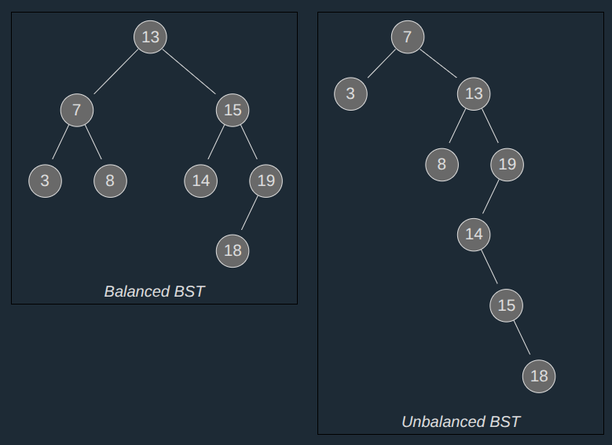
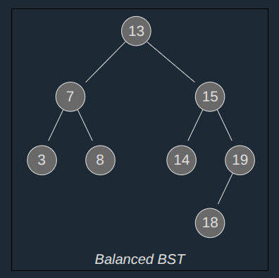
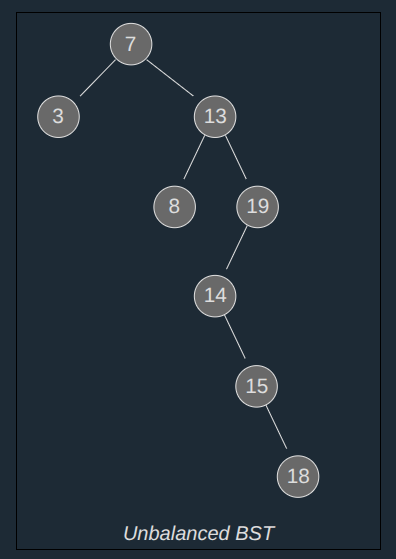

>A **Binary Search Tree** is a Binary Tree where every node's left child has a lower value, and every node's right child has a higher value.

A clear advantage with Binary Search Trees is that operations like search, delete, and insert are fast and done without having to shift values in memory.

---
## Binary Search Trees

A Binary Search Tree (BST) is a type of _Binary Tree data structure_, where the following properties must be true for any node "X" in the tree:

- The X node's left child and all of its descendants (children, children's children, and so on) have lower values than X's value.
- The right child, and all its descendants have higher values than X's value.
- Left and right subtrees must also be Binary Search Trees.

These properties makes it faster to search, add and delete values than a regular binary tree.

To make this as easy to understand and implement as possible, let's also assume that all values in a Binary Search Tree are unique.

The **size** of a tree is the number of nodes in it `(n)`.

A **subtree** starts with one of the nodes in the tree as a local root, and consists of that node and all its descendants.

The **descendants** of a node are all the child nodes of that node, and all their child nodes, and so on. Just start with a node, and the descendants will be all nodes that are connected below that node.

The **node's height** is the maximum number of edges between that node and a leaf node.

A **node's in-order successor** is the node that comes after it if we were to do in-order traversal. In-order traversal of the BST above would result in node 13 coming before node 14, and so the successor of node 13 is node 14.

---
## Traversal of a Binary Search Tree

```
class TreeNode:
  def __init__(self, data):
    self.data = data
    self.left = None
    self.right = None

def inOrderTraversal(node):
  if node is None:
    return
  inOrderTraversal(node.left)
  print(node.data, end=", ")
  inOrderTraversal(node.right)

root = TreeNode(13)
node7 = TreeNode(7)
node15 = TreeNode(15)
node3 = TreeNode(3)
node8 = TreeNode(8)
node14 = TreeNode(14)
node19 = TreeNode(19)
node18 = TreeNode(18)

root.left = node7
root.right = node15

node7.left = node3
node7.right = node8

node15.left = node14
node15.right = node19

node19.left = node18

# Traverse
inOrderTraversal(root)

#Output:
3, 7, 8, 13, 14, 15, 18, 19,
```

---
## Search for a Value in a BST
Searching for a value in a BST is very similar to how we found a value using Binary Search on an array.

For Binary Search to work, the array must be sorted already, and searching for a value in an array can then be done really fast.

Similarly, searching for a value in a BST can also be done really fast because of how the nodes are placed.

**How it works:**

1. Start at the root node.
2. If this is the value we are looking for, return.
3. If the value we are looking for is higher, continue searching in the right subtree.
4. If the value we are looking for is lower, continue searching in the left subtree.
5. If the subtree we want to search does not exist, depending on the programming language, return `None`, or `NULL`, or something similar, to indicate that the value is not inside the BST.
#### Search the Tree for the value "13":
```
class TreeNode:
  def __init__(self, data):
    self.data = data
    self.left = None
    self.right = None

def search(node, target):
  if node is None:
    return None
  elif node.data == target:
    return node
  elif target < node.data:
    return search(node.left, target)
  else:
    return search(node.right, target)

root = TreeNode(13)
node7 = TreeNode(7)
node15 = TreeNode(15)
node3 = TreeNode(3)
node8 = TreeNode(8)
node14 = TreeNode(14)
node19 = TreeNode(19)
node18 = TreeNode(18)

root.left = node7
root.right = node15

node7.left = node3
node7.right = node8

node15.left = node14
node15.right = node19

node19.left = node18

# Search for a value
result = search(root, 13)
if result:
  print(f"Found the node with value: {result.data}")
else:
  print("Value not found in the BST.")
  
#Output:
Found the node with value: 13
```
**The time complexity for searching a BST for a value is `O(h)`, where `h` is the height of the tree.**

_For a BST with most nodes on the right side for example, the height of the tree becomes larger than it needs to be, and the worst case search will take longer. Such trees are called unbalanced._


Both Binary Search Trees above have the same nodes, and in-order traversal of both trees gives us the same result but the height is very different. It takes longer time to search the unbalanced tree above because it is higher.

We will use the next page to describe a type of Binary Tree called AVL Trees. AVL trees are self-balancing, which means that the height of the tree is kept to a minimum so that operations like search, insertion and deletion take less time.

---
## Insert a Node in a BST
Inserting a node in a BST is similar to searching for a value.

**How it works:**

1. Start at the root node.
2. Compare each node:
    - Is the value lower? Go left.
    - Is the value higher? Go right.
3. Continue to compare nodes with the new value until there is no right or left to compare with. That is where the new node is inserted.
```
class TreeNode:
  def __init__(self, data):
    self.data = data
    self.left = None
    self.right = None

def insert(node, data):
  if node is None:
    return TreeNode(data)
  else:
    if data < node.data:
      node.left = insert(node.left, data)
    elif data > node.data:
      node.right = insert(node.right, data)
    return node

def inOrderTraversal(node):
  if node is None:
    return
  inOrderTraversal(node.left)
  print(node.data, end=", ")
  inOrderTraversal(node.right)

root = TreeNode(13)
node7 = TreeNode(7)
node15 = TreeNode(15)
node3 = TreeNode(3)
node8 = TreeNode(8)
node14 = TreeNode(14)
node19 = TreeNode(19)
node18 = TreeNode(18)

root.left = node7
root.right = node15

node7.left = node3
node7.right = node8

node15.left = node14
node15.right = node19

node19.left = node18

# Inserting new value into the BST
insert(root, 10)

# Traverse
inOrderTraversal(root)

#Output:
3, 7, 8, 10, 13, 14, 15, 18, 19,
```

---
## Find The Lowest Value in a BST Subtree
The next section will explain how we can delete a node in a BST, but to do that we need a function that finds the lowest value in a node's subtree.

**How it works:**
1. Start at the root node of the subtree.
2. Go left as far as possible.
3. The node you end up in is the node with the lowest value in that BST subtree.
#### Find the lowest value in a BST subtree:
```
class TreeNode:
  def __init__(self, data):
    self.data = data
    self.left = None
    self.right = None

def inOrderTraversal(node):
  if node is None:
    return
  inOrderTraversal(node.left)
  print(node.data, end=", ")
  inOrderTraversal(node.right)

def minValueNode(node):
  current = node
  while current.left is not None:
    current = current.left
  return current

root = TreeNode(13)
node7 = TreeNode(7)
node15 = TreeNode(15)
node3 = TreeNode(3)
node8 = TreeNode(8)
node14 = TreeNode(14)
node19 = TreeNode(19)
node18 = TreeNode(18)

root.left = node7
root.right = node15

node7.left = node3
node7.right = node8

node15.left = node14
node15.right = node19

node19.left = node18

# Traverse
inOrderTraversal(root)

# Find Lowest
print("\nLowest value:",minValueNode(root).data)

#Output:
3, 7, 8, 13, 14, 15, 18, 19,  
Lowest value: 3
```

---
## Delete a Node in a BST
To delete a node, our function must first search the BST to find it.

After the node is found there are three different cases where deleting a node must be done differently.

**How it works:**

1. If the node is a leaf node, remove it by removing the link to it.
2. If the node only has one child node, connect the parent node of the node you want to remove to that child node.
3. If the node has both right and left child nodes: Find the node's in-order successor, change values with that node, then delete it.

In step 3 above, the successor we find will always be a leaf node, and because it is the node that comes right after the node we want to delete, we can swap values with it and delete it.

#### Delete a Node in a BST‍‍‍:
```
class TreeNode:
    def __init__(self, data):
        self.data = data
        self.left = None
        self.right = None

def inOrderTraversal(node):
    if node is None:
        return
    inOrderTraversal(node.left)
    print(node.data, end=", ")
    inOrderTraversal(node.right)

def minValueNode(node):
    current = node
    while current.left is not None:
        current = current.left
    return current

def delete(node, data):
    if not node:
        return None

    if data < node.data:
        node.left = delete(node.left, data)
    elif data > node.data:
        node.right = delete(node.right, data)
    else:
        # Node with only one child or no child
        if not node.left:
            temp = node.right
            node = None
            return temp
        elif not node.right:
            temp = node.left
            node = None
            return temp

        # Node with two children, get the in-order successor
        node.data = minValueNode(node.right).data
        node.right = delete(node.right, node.data)

    return node

root = TreeNode(13)
node7 = TreeNode(7)
node15 = TreeNode(15)
node3 = TreeNode(3)
node8 = TreeNode(8)
node14 = TreeNode(14)
node19 = TreeNode(19)
node18 = TreeNode(18)

root.left = node7
root.right = node15

node7.left = node3
node7.right = node8

node15.left = node14
node15.right = node19

node19.left = node18

# Traverse
inOrderTraversal(root)

# Delete node 15
delete(root,15)

# Traverse
print() # Creates a new line
inOrderTraversal(root)

#Output:
3, 7, 8, 13, 14, 15, 18, 19,  
3, 7, 8, 13, 14, 18, 19,
```
**Line 1**: The `node` argument here makes it possible for the function to call itself recursively on smaller and smaller subtrees in the search for the node with the `data` we want to delete.

**Line 2-8**: This is searching for the node with correct `data` that we want to delete.

**Line 9-22**: The node we want to delete has been found. There are three such cases:

1. **Case 1**: Node with no child nodes (leaf node). `None` is returned, and that becomes the parent node's new left or right value by recursion (line 6 or 8).
2. **Case 2**: Node with either left or right child node. That left or right child node becomes the parent's new left or right child through recursion (line 7 or 9).
3. **Case 3**: Node has both left and right child nodes. The in-order successor is found using the `minValueNode()` function. We keep the successor's value by setting it as the value of the node we want to delete, and then we can delete the successor node.

**Line 24**: `node` is returned to maintain the recursive functionality.

---
## BST Compared to Other Data Structures

Binary Search Trees take the best from two other data structures: Arrays and Linked Lists.

| Data Structure     | Searching for a value | Delete / Insert leads to shifting in memory |
| ------------------ | --------------------- | ------------------------------------------- |
| Sorted Array       | `O(log n)`            | Yes                                         |
| Linked List        | `O(n)`                | **No**                                      |
| Binary Search Tree | `O(log n)`            | **No**                                      |
Searching a BST is just as fast as Binary Search on an array, with the same time complexity `O(log n)`.

And deleting and inserting new values can be done without shifting elements in memory, just like with Linked Lists.

---
## BST Balance and Time Complexity

On a Binary Search Tree, operations like inserting a new node, deleting a node, or searching for a node are actually `O(h)`. That means that the higher the tree is (`h`), the longer the operation will take.

The reason why we wrote that searching for a value is `O(log n)` in the table above is because that is true if the tree is "balanced", like in the image below.



We call this tree balanced because there are approximately the same number of nodes on the left and right side of the tree.

The exact way to tell that a Binary Tree is balanced is that the height of the left and right subtrees of any node only differs by one. In the image above, the left subtree of the root node has height `h=2`, and the right subtree has height `h=3`.

For a balanced BST, with a large number of nodes (big `n`), we get height `h ≈ log_2 n`, and therefore the time complexity for searching, deleting, or inserting a node can be written as `O(h) = O(log n)`.

But, in case the BST is completely unbalanced, like in the image below, the height of the tree is approximately the same as the number of nodes, `h ≈ n`, and we get time complexity `O(h) = O(n)` for searching, deleting, or inserting a node.



So, to optimize operations on a BST, the height must be minimized, and to do that the tree must be balanced.

And keeping a Binary Search Tree balanced is exactly what **AVL Trees** do, which is the data structure explained on the next page.