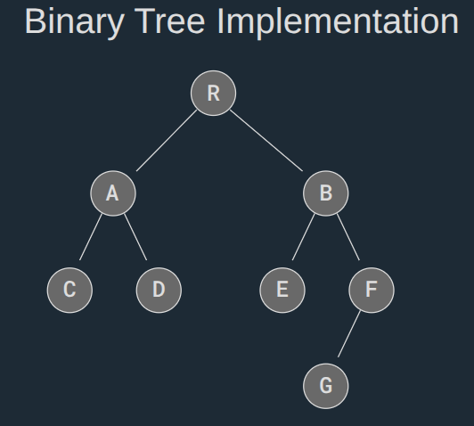
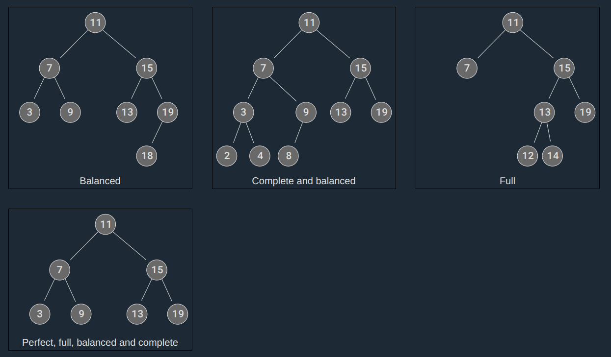

A Binary Tree is a type of tree data structure where each node can have a maximum of two child nodes, a left child node and a right child node.

This restriction, that a node *can have a maximum of two child nodes*, gives us many benefits:

- Algorithms like traversing, searching, insertion and deletion become easier to understand, to implement, and run faster.
- Keeping data sorted in a Binary Search Tree (BST) makes searching very efficient.
- Balancing trees is easier to do with a limited number of child nodes, using an AVL Binary Tree for example.
- Binary Trees can be represented as arrays, making the tree more memory efficient.


The Binary Tree above can be implemented much like a Linked List, except that instead of linking each node to one next node, we create a structure where each node can be linked to both its left and right child nodes.
#### Create a Binary Tree in Python:
```
class TreeNode:
  def __init__(self, data):
    self.data = data
    self.left = None
    self.right = None

root = TreeNode('R')
nodeA = TreeNode('A')
nodeB = TreeNode('B')
nodeC = TreeNode('C')
nodeD = TreeNode('D')
nodeE = TreeNode('E')
nodeF = TreeNode('F')
nodeG = TreeNode('G')

root.left = nodeA
root.right = nodeB

nodeA.left = nodeC
nodeA.right = nodeD

nodeB.left = nodeE
nodeB.right = nodeF

nodeF.left = nodeG

# Test
print("root.right.left.data:", root.right.left.data)

#Output:
root.right.left.data: E
```

---
## Types of Binary Trees

There are different variants, or types, of Binary Trees worth discussing to get a better understanding of how Binary Trees can be structured.

A **balanced** Binary Tree has at most 1 in difference between its left and right subtree heights, for each node in the tree.

A **complete** Binary Tree has all levels full of nodes, except the last level, which is can also be full, or filled from left to right. The properties of a complete Binary Tree means it is also balanced.

A **full** Binary Tree is a kind of tree where each node has either 0 or 2 child nodes.

A **perfect** Binary Tree has all leaf nodes on the same level, which means that all levels are full of nodes, and all internal nodes have two child nodes.The properties of a perfect Binary Tree means it is also full, balanced, and complete.


---
## Binary Tree Traversal

Going through a Tree by visiting every node, one node at a time, is called traversal.

There are two main categories of Tree traversal methods:

**Breadth First Search (BFS)** is when the nodes on the same level are visited before going to the next level in the tree. This means that the tree is explored in a more sideways direction.

**Depth First Search (DFS)** is when the traversal moves down the tree all the way to the leaf nodes, exploring the tree branch by branch in a downwards direction.

There are three different types of DFS traversals:

- pre-order
- in-order
- post-order

---
## Pre-order Traversal of Binary Trees

**Pre-order traversal** follows the pattern: **Root → Left → Right**
### Visual Flow for Pre-order
```
       1 (Root)
      / \
     2   3
    / \   \
   4   5   6

Pre-order Output: 1, 2, 4, 5, 3, 6
```
Pre-order Traversal is a type of *Depth First Search*, where each node is visited in a certain order..

Pre-order Traversal is done by visiting the root node first, then recursively do a pre-order traversal of the left subtree, followed by a recursive pre-order traversal of the right subtree. It's used for creating a copy of the tree, prefix notation of an expression tree, etc.

This traversal is "pre" order because the node is visited "before" the recursive pre-order traversal of the left and right subtrees.
#### Pre-order traversal:
```
class TreeNode:
  def __init__(self, data):
    self.data = data
    self.left = None
    self.right = None

def preOrderTraversal(node):
  if node is None:
    return
  print(node.data, end=", ")
  preOrderTraversal(node.left)
  preOrderTraversal(node.right)

root = TreeNode('R')
nodeA = TreeNode('A')
nodeB = TreeNode('B')
nodeC = TreeNode('C')
nodeD = TreeNode('D')
nodeE = TreeNode('E')
nodeF = TreeNode('F')
nodeG = TreeNode('G')

root.left = nodeA
root.right = nodeB

nodeA.left = nodeC
nodeA.right = nodeD

nodeB.left = nodeE
nodeB.right = nodeF

nodeF.left = nodeG

# Traverse
preOrderTraversal(root)

#Output:
R, A, C, D, B, E, F, G,
```
The `preOrderTraversal()` function keeps traversing the left subtree recursively (line 5), before going on to traversing the right subtree (line 6). So the next nodes that are printed are 'A' and then 'C'.

The first time the argument `node` is `None` is when the left child of node C is given as an argument (C has no left child).

After `None` is returned the first time when calling C's left child, C's right child also returns `None`, and then the recursive calls continue to propagate back so that A's right child D is the next to be printed.

The code continues to propagate back so that the rest of the nodes in R's right subtree gets printed.

---
## In-order Traversal of Binary Trees
**In-order traversal** follows the pattern: **Left → Root → Right**
### Visual Flow for In-order
```
        [A]
       /    \
     [B]    [C]
    /   \   /  \
  [D]  [E][F]  [G]

  Step 1: Go left from A
        [A]
       /
     [B] ←
    /   \
  [D]  [E]

  Step 2: Go left from B
        [A]
       /
     [B]
    /
  [D] ←

  Step 3: Visit D → Output: D

  Step 4: Visit B → Output: D, B

  Step 5: Go right to E → Visit E → Output: D, B, E

  Step 6: Visit A → Output: D, B, E, A

  Step 7: Go right to C → then left to F → Visit F → Output: D, B, E, A, F

  Step 8: Visit C → Output: D, B, E, A, F, C

  Step 9: Go right to G → Visit G → Output: D, B, E, A, F, C, G
```
In-order Traversal is a type of Depth First Search, where each node is visited in a certain order.

In-order Traversal does a *recursive In-order Traversal* of the left subtree, visits the root node, and finally, does a recursive In-order Traversal of the right subtree. This traversal is mainly used for Binary Search Trees where it returns values in ascending order.

What makes this traversal "in" order, is that the node is visited in between the recursive function calls. The node is visited after the In-order Traversal of the left subtree, and before the In-order Traversal of the right subtree.
#### In-order Traversal:
```
class TreeNode:
  def __init__(self, data):
    self.data = data
    self.left = None
    self.right = None

def inOrderTraversal(node):
  if node is None:
    return
  inOrderTraversal(node.left)
  print(node.data, end=", ")
  inOrderTraversal(node.right)
    
root = TreeNode('R')
nodeA = TreeNode('A')
nodeB = TreeNode('B')
nodeC = TreeNode('C')
nodeD = TreeNode('D')
nodeE = TreeNode('E')
nodeF = TreeNode('F')
nodeG = TreeNode('G')

root.left = nodeA
root.right = nodeB

nodeA.left = nodeC
nodeA.right = nodeD

nodeB.left = nodeE
nodeB.right = nodeF

nodeF.left = nodeG

# Traverse
inOrderTraversal(root)

#Output:
C, A, D, R, E, B, G, F,
```
**Attention:** *To better understand how recursive functions works, and how All these three codes (pre-order, in-order, post-order) works via Recursive function, [[Explanation of In-order Binary Tree code|see here]].*

The `inOrderTraversal()` function keeps calling itself with the current left child node as an argument (line 4) until that argument is `None` and the function returns (line 2-3).

The first time the argument `node` is `None` is when the left child of node C is given as an argument (C has no left child).

After that, the `data` part of node C is printed (line 5), which means that 'C' is the first thing that gets printed.

Then, node C's right child is given as an argument (line 6), which is `None`, so the function call returns without doing anything else.

After 'C' is printed, the previous `inOrderTraversal()` function calls continue to run, so that 'A' gets printed, then 'D', then 'R', and so on.

---
## Post-order Traversal of Binary Trees
**Post-order traversal** follows the pattern: **Left → Right → Root**
### Visual Flow for Post-order
```
        [A]
       /    \
     [B]    [C]
    /   \   /  \
  [D]  [E][F]  [G]
  
	Step 1: Go left from A
        [A]
       /
     [B] ←
    /   \
  [D]  [E]
  
  Step 2: Go left from B
        [A]
       /
     [B]
    /
  [D] ←
  
	Step 3: Visit D
	Output: D
        [A]
       /
     [B]
    /
  [D]✓
  
  Step 4: Visit B (after left subtree done)
  Output: D, B
        [A]
       /
     [B]✓
    /   \
  [D]✓ [E]

	Step 5: Go right to E → Visit E
	Output: D, B, E
        [A]
       /
     [B]✓
    /   \
  [D]✓ [E]✓

	Step 6: Visit A (after left subtree complete)
	Output: D, B, E, A
        [A]✓
       /    \
     [B]✓  [C]
    /   \  /  \
  [D]✓ [E]✓[F][G]
  
  Step 7: Go right to C → then left to F → Visit F
  Output: D, B, E, A, F
        [A]✓
       /    \
     [B]✓  [C]
    /   \  /  \
  [D]✓ [E]✓[F]✓[G]
  
  Step 8: Visit C (after left subtree done)
  Output: D, B, E, A, F, C
        [A]✓
       /    \
     [B]✓  [C]✓
    /   \  /  \
  [D]✓ [E]✓[F]✓[G]
  
	Step 9: Go right to G → Visit G
	Output: D, B, E, A, F, C, G
        [A]✓
       /    \
     [B]✓  [C]✓
    /   \  /  \
  [D]✓ [E]✓[F]✓[G]✓
  
	Final Output (Post-order):
	D, B, E, A, F, C, G
```

Post-order Traversal is a type of *Depth First Search*, where each node is visited in a certain order.

Post-order Traversal works by recursively doing a Post-order Traversal of the left subtree and the right subtree, followed by a visit to the root node. It is used for deleting a tree, post-fix notation of an expression tree, etc.

What makes this traversal "post" is that visiting a node is done "after" the left and right child nodes are called recursively.
#### Post-order Traversal:
```
class TreeNode:
  def __init__(self, data):
    self.data = data
    self.left = None
    self.right = None

def postOrderTraversal(node):
  if node is None:
    return
  postOrderTraversal(node.left)
  postOrderTraversal(node.right)
  print(node.data, end=", ")
    
root = TreeNode('R')
nodeA = TreeNode('A')
nodeB = TreeNode('B')
nodeC = TreeNode('C')
nodeD = TreeNode('D')
nodeE = TreeNode('E')
nodeF = TreeNode('F')
nodeG = TreeNode('G')

root.left = nodeA
root.right = nodeB

nodeA.left = nodeC
nodeA.right = nodeD

nodeB.left = nodeE
nodeB.right = nodeF

nodeF.left = nodeG

# Traverse
postOrderTraversal(root)

#Output:
C, D, A, E, G, F, B, R,
```
The `postOrderTraversal()` function keeps traversing the left subtree recursively (line 4), until `None` is returned when C's left child node is called as the `node` argument.

After C's left child node returns `None`, line 5 runs and C's right child node returns `None`, and then the letter 'C' is printed (line 6).

This means that C is visited, or printed, "after" its left and right child nodes are traversed, that is why it is called "post" order traversal.

The `postOrderTraversal()` function continues to propagate back to previous recursive function calls, so the next node to be printed is 'D', then 'A'.

The function continues to propagate back and printing nodes until all nodes are printed, or visited.