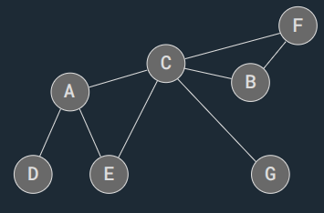
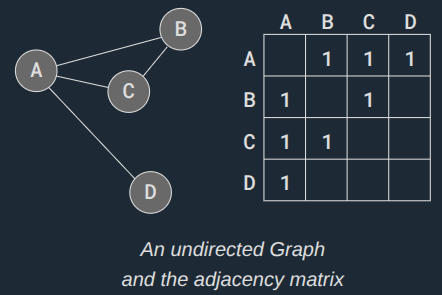
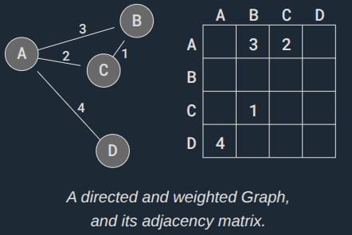
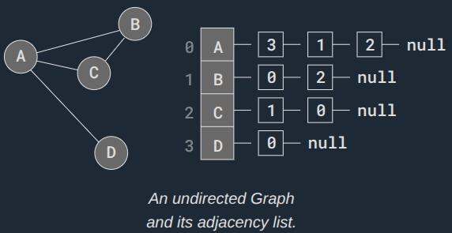
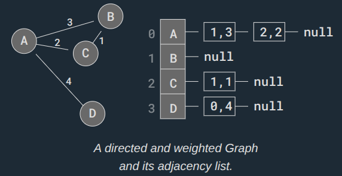

A Graph is a non-linear data structure that consists of vertices (nodes) and edges.

A vertex, also called a node, is a point or an object in the Graph, and an edge is used to connect two vertices with each other.

Graphs are non-linear because the data structure allows us to have different paths to get from one vertex to another, unlike with linear data structures like Arrays or Linked Lists.

Graphs are used to represent and solve problems where the data consists of objects and relationships between them, such as:

- Social Networks: Each person is a vertex, and relationships (like friendships) are the edges. Algorithms can suggest potential friends.
- Maps and Navigation: Locations, like a town or bus stops, are stored as vertices, and roads are stored as edges. Algorithms can find the shortest route between two locations when stored as a Graph.
- Internet: Can be represented as a Graph, with web pages as vertices and hyperlinks as edges.
- Biology: Graphs can model systems like neural networks or the spread of diseases.

## Graph Representations

A Graph representation tells us how a Graph is stored in memory.

Different Graph representations can:

- take up more or less space.
- be faster or slower to search or manipulate.
- be better suited depending on what type of Graph we have (weighted, directed, etc.), and what we want to do with the Graph.
- be easier to understand and implement than others.

Below are short introductions of the different Graph representations, but Adjacency Matrix is the representation we will use for Graphs moving forward in this tutorial, as it is easy to understand and implement, and works in all cases relevant for this tutorial.

Graph representations store information about which vertices are adjacent, and how the edges between the vertices are. Graph representations are slightly different if the edges are directed or weighted.

Two vertices are adjacent, or neighbors, if there is an edge between them.

## Adjacency Matrix Graph Representation

Adjacency Matrix is the Graph representation (structure) we will use for this tutorial.

How to implement an Adjacency Matrix is shown on the next page.

The Adjacency Matrix is a 2D array (matrix) where each cell on index `(i,j)` stores information about the edge from vertex `i` to vertex `j`.

Below is a Graph with the Adjacency Matrix representation next to it.

The adjacency matrix above represents an undirected Graph, so the values '1' only tells us where the edges are. Also, the values in the adjacency matrix is symmetrical because the edges go both ways (undirected Graph).

To create a directed Graph with an adjacency matrix, we must decide which vertices the edges go from and to, by inserting the value at the correct indexes `(i,j)`. To represent a weighted Graph we can put other values than '1' inside the adjacency matrix.

Below is a directed and weighted Graph with the Adjacency Matrix representation next to it.

In the adjacency matrix above, the value `3` on index `(0,1)` tells us there is an edge from vertex A to vertex B, and the weight for that edge is `3`.

As you can see, the weights are placed directly into the adjacency matrix for the correct edge, and for a directed Graph, the adjacency matrix does not have to be symmetric.

## Adjacency List Graph Representation

In case we have a 'sparse' Graph with many vertices, we can save space by using an Adjacency List compared to using an Adjacency Matrix, because an Adjacency Matrix would reserve a lot of memory on empty Array elements for edges that don't exist.

A 'sparse' Graph is a Graph where each vertex only has edges to a small portion of the other vertices in the Graph.

An Adjacency List has an array that contains all the vertices in the Graph, and each vertex has a Linked List (or Array) with the vertex's edges.

In the adjacency list above, the vertices A to D are placed in an Array, and each vertex in the array has its index written right next to it.

Each vertex in the Array has a pointer to a Linked List that represents that vertex's edges. More specifically, the Linked List contains the indexes to the adjacent (neighbor) vertices.

So for example, vertex A has a link to a Linked List with values 3, 1, and 2. These values are the indexes to A's adjacent vertices D, B, and C.

An Adjacency List can also represent a directed and weighted Graph, like this:

In the Adjacency List above, vertices are stored in an Array. Each vertex has a pointer to a Linked List with edges stored as `i,w`, where `i` is the index of the vertex the edge goes to, and `w` is the weight of that edge.

Node D for example, has a pointer to a Linked List with an edge to vertex A. The values `0,4` means that vertex D has an edge to vertex on index `0` (vertex A), and the weight of that edge is `4`.