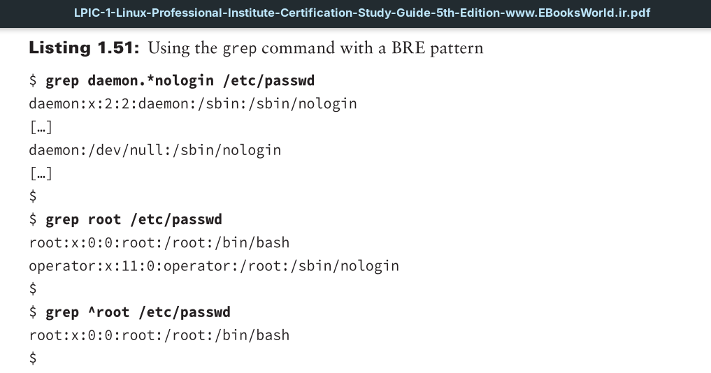
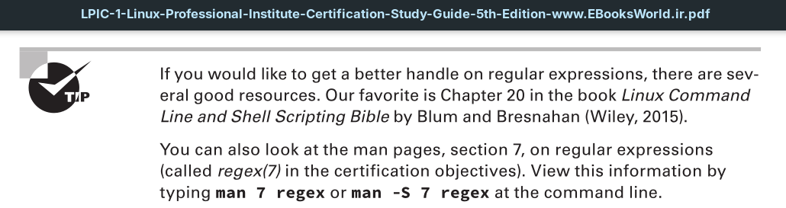
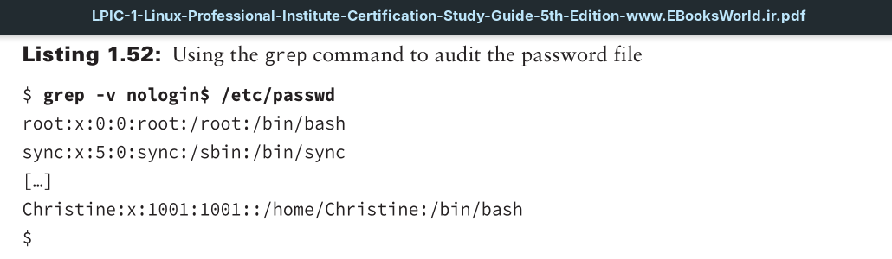
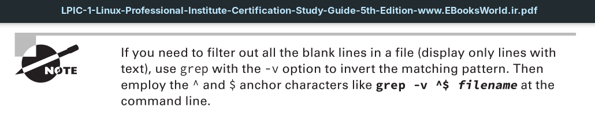
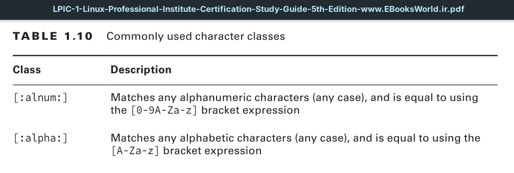
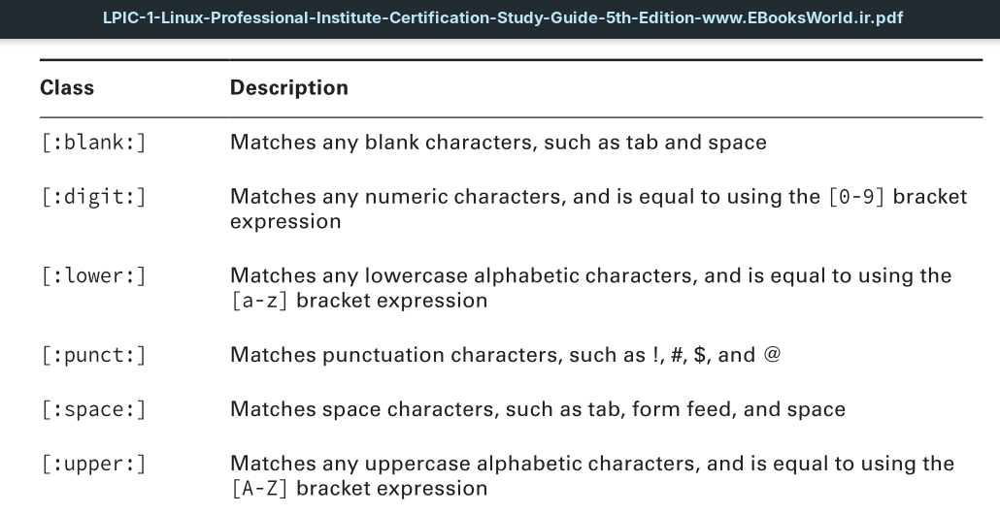
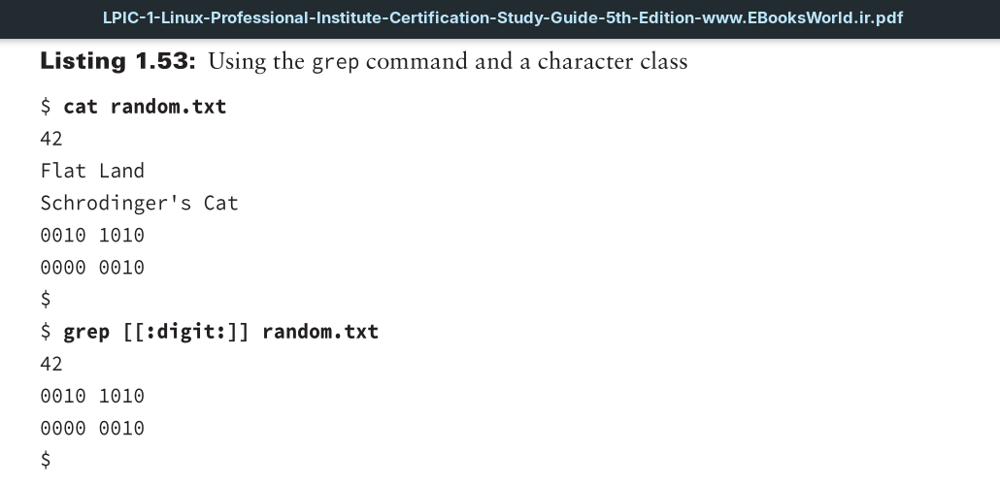
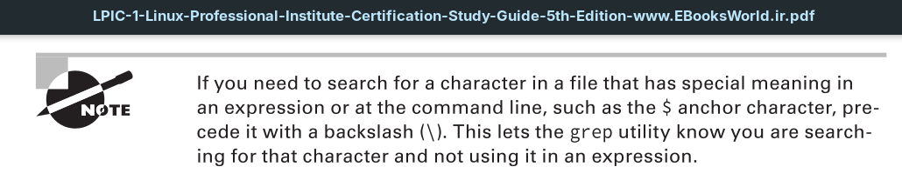

The contraction of 'Basic Regular Expressions' is 'BRE'.

To find text file records that begin with particular characters, you can precede them with a caret (^) symbol.
For finding text file records where particular characters are at the record’s end, append them with a dollar sign ($) symbol.

For using character classes with the grep command, enclose the bracketed character class in another set of brackets.

Notice the extra brackets needed to properly use a character class. Thus, to use `[:digit:]`, you must type `[[:digit:]]` when employing this character class with the grep command.

