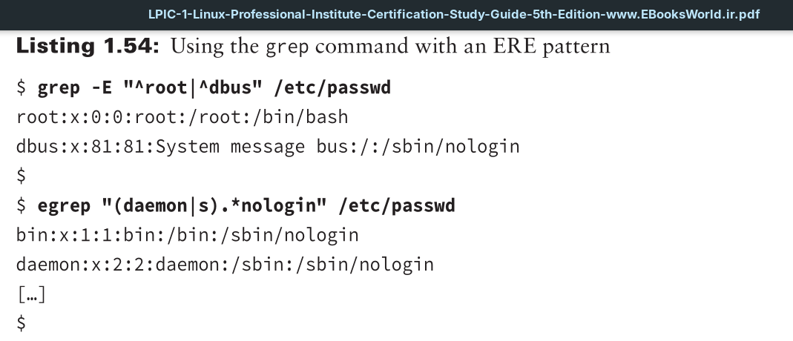
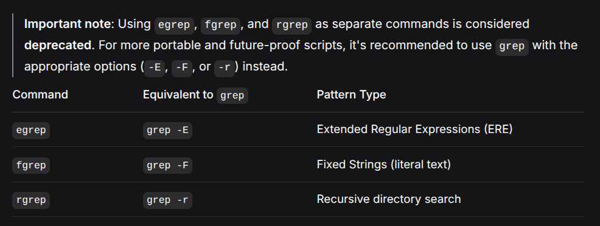

The contraction of 'Extended Regular Expressions' is 'ERE'.

A vertical bar symbol (|) allows you to specify two possible words or character sets to match.

In the first example, the grep command uses the -E option to indicate the pattern is an extended regular expression. If you did not employ the -E option, unpredictable results would occur. Quotation marks around the ERE pattern protect it from misinterpretation. The command searches for any password file records that start with either the word root or the word dbus. Thus, a caret (^) is placed prior to each word, and a vertical bar (|) separates the words to indicate that the record can start with either word.

In the second example in Listing 1.54, notice that the `egrep` command is employed. The `egrep` command is equivalent to using the `grep -E` command. The ERE pattern here also uses quotation marks to avoid misinterpretation and employs parentheses to issue a sub-expression. The sub-expression consists of a choice, indicated by the vertical bar (|), between the word daemon and the letter s. Also in the ERE pattern, the .* symbols are used to indicate there can be anything in between the sub-expression choice and the word `nologin` in the text file record.
