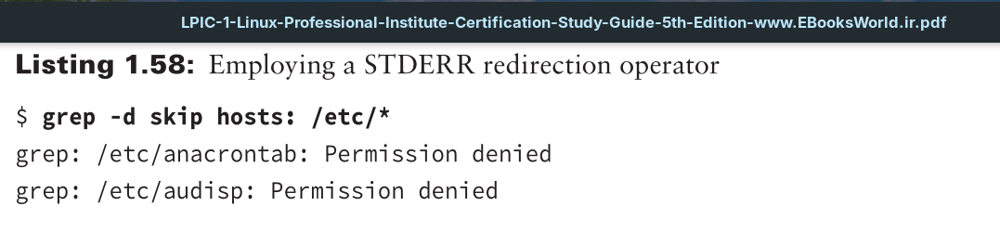
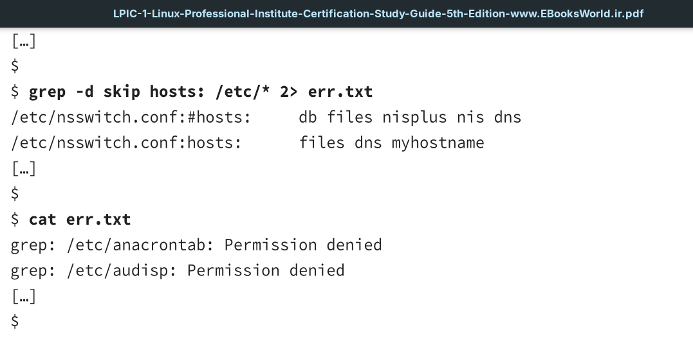
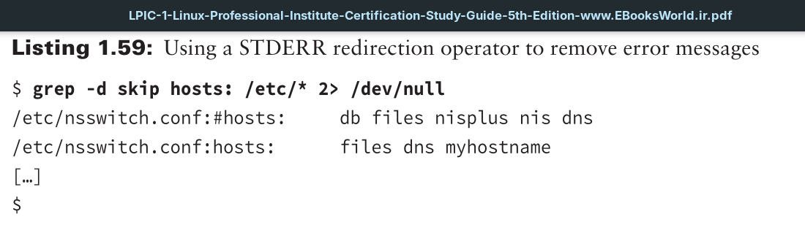

Another handy item to redirect is standard error. The file descriptor that identifies a command or script file error is **2**. It is also identified by the abbreviation `STDERR`, which describes standard error. `STDERR`, like `STDOUT`, is by default sent to your terminal (`/dev/tty`).
The basic redirection operator to send STDERR to a file is the `2>` operator. If you need to append the file, use the `2>>` operator.

If you don’t care to keep a copy of the error messages, you can always throw them away.
This is done by redirecting STDERR to the `/dev/null` file.

The `/dev/null` file is sometimes called the black hole. This name comes from the fact that anything you put into it, you cannot retrieve.
