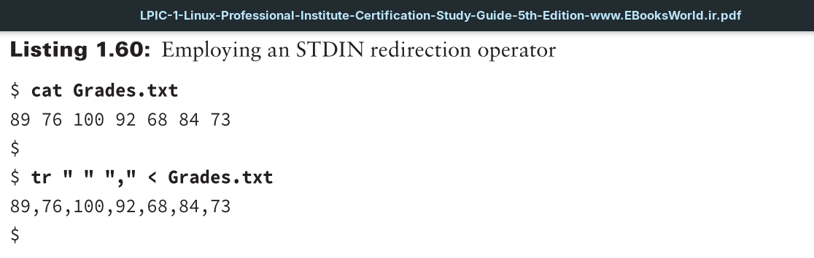
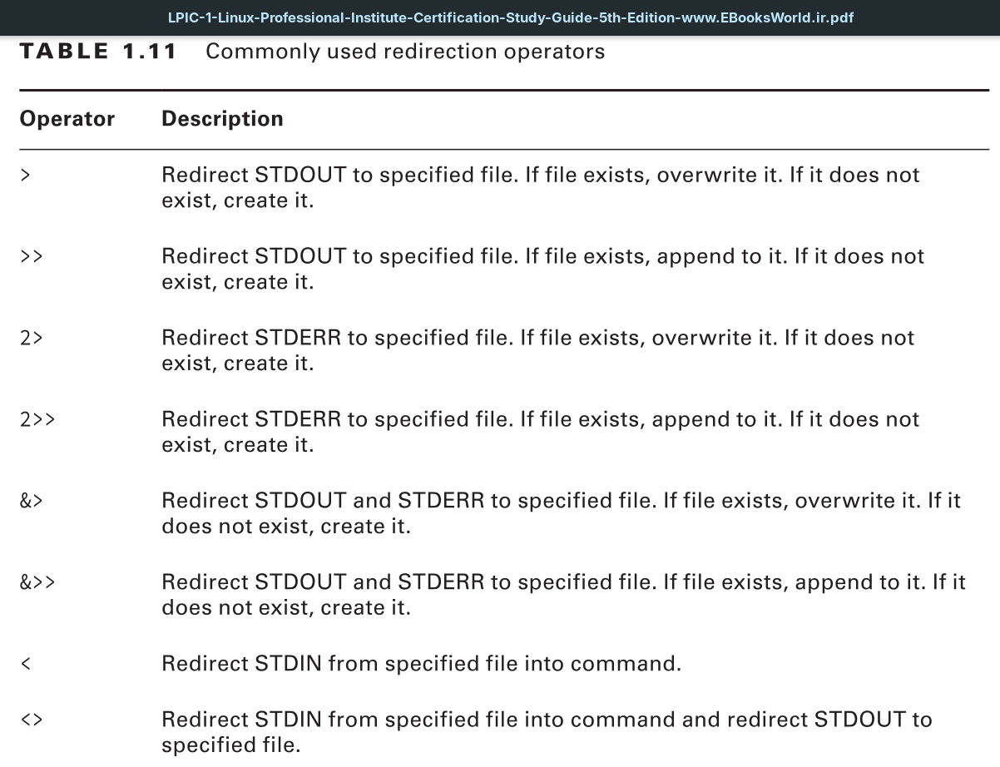

Standard input, by default, comes into your Linux system via the keyboard and/or other input devices. The file descriptor that identifies an input into a command or script file is 0. It is also identified by the abbreviation `STDIN`, which describes standard input.

As with `STDOUT` and `STDERR`, you can redirect `STDIN`. The basic redirection operator is the < symbol. The `tr` command is one of the few utilities that require you to redirect standard input.

In Listing 1.60, the file `Grades.txt` contains various integers separated by a space. The second command utilizes the tr utility to change each space into a comma (`,`). Because the tr command requires the `STDIN` redirection symbol, it is also employed in the second command followed by the filename. Keep in mind that this command did not change the `Grades.txt` file. It only displayed to `STDOUT` what the file would look like with these changes.

