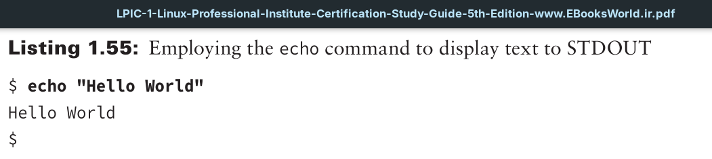
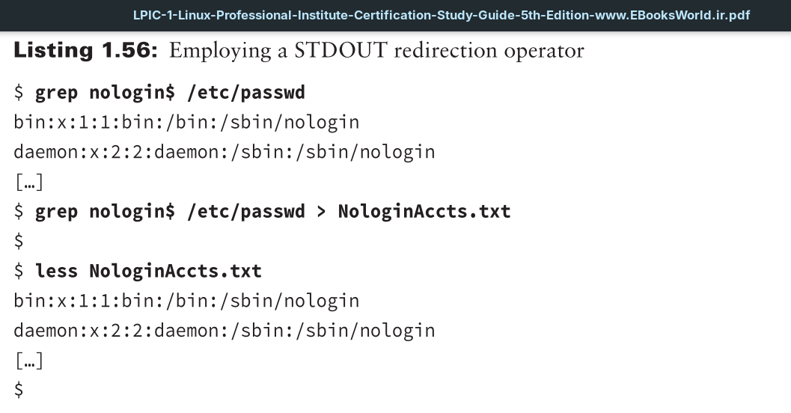
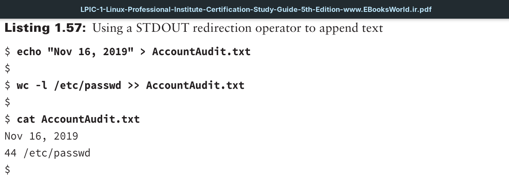

It is important to know that Linux treats every object as a file. This includes the output process, such as displaying a text file on the screen. Each file object is identified using a file descriptor, an integer that classifies a process’s open files. The file descriptor that identifies output from a command or script file is **1**. It is also identified by the abbreviation STDOUT, which describes standard output.
By default, STDOUT (standard output) directs output to your current terminal. Your process’s current terminal is represented by the `/dev/tty` file.
A simple command to use when discussing standard output is the echo command. Issue the echo command along with a text string, and the text string will display to your process’s STDOUT, which is typically the terminal screen.

To append data to a preexisting file, you need to use a slightly different redirection operator. The >> operator will append data to a preexisting file. If the file does not exist, it is created, and the outputted data is added to it.

