```
echo $SHELL
```

```
echo $BASH_VERSION
```

or 
```
echo $ZSH_VERSION
```

Depends on your default shell;

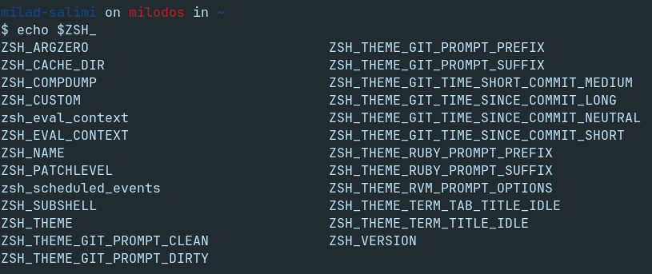

---
uname - print system information

```
uname
```

see `man uname` on shell for more useful information.

>**Note:** Always read `man something` in `shell` for more and useful information.

---
Using `type` to determine whether a command is external (isn't part of the shell) or internal (is part of the shell).
```
type echo

# output:
echo is a shell builtin
```

```
type pwd

# outptu:
pwd is a shell builtin
```

```
type uname

# output:
uname is /usr/bin/uname
```

>**Note:** A command may be available both internally and externally to the shell. In this case, it is important to know their differences, because they may produce slightly different results or require different options.

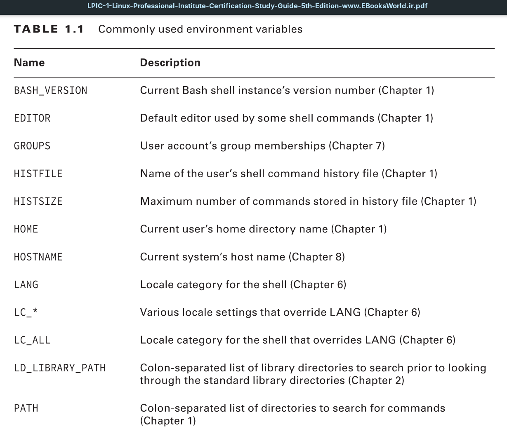

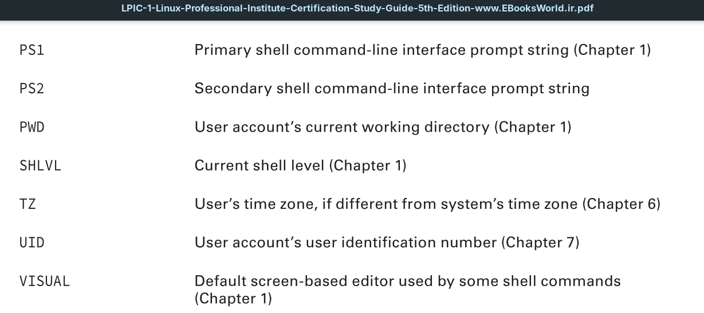

---
Using `set` to display active environment variables.


When you enter a program name (command) at the shell prompt, the shell will search all the directories listed in the `PATH` environment variable for that program. If the shell cannot find the program, you will receive a command not found error message.

To see `PATH`:
```
echo $PATH
```

#### [[how to add an extra path to the PATH environment value in shell?]]

The `which` utility is helpful in these cases. It searches through the `PATH` directories to find the program (**NOTE:** `which` command just locates a *command* **NOT** directories - **ONLY** searches for *executable* files). 
If it locates the program, it displays its absolute directory reference. This saves you from having to look through the PATH variable’s output yourself;

To run a program that does not reside in a `PATH` directory location, you must provide the command’s absolute directory reference when entering the program’s name at the command line;

---
You can modify environment variables. An easy one to change is the variable controlling your shell prompt (PS1);

```
echo $PS1
```

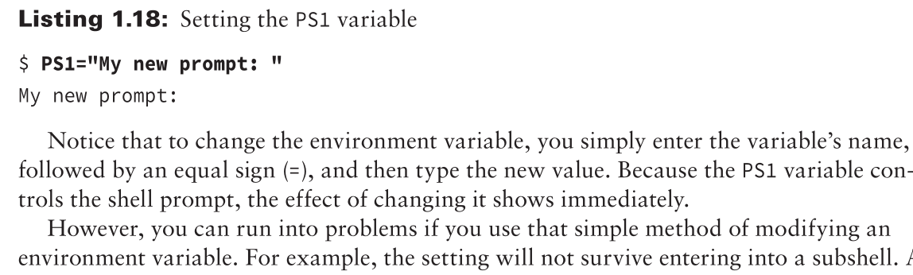

You can determine whether your process is currently in a subshell by looking at the data stored in the `SHLVL` environment variable. A 1 indicates you are not in a subshell, because subshells have higher numbers. Thus, if `SHLVL` contains a number higher than 1, this indicates you’re in a subshell.

```
echo $SHLVL 

# output:
2    # subshell
```

Also note that the `PS1` environment variable controlling the prompt does
not survive entering into a subshell.

To preserve an environment variable’s setting, you need to employ the `export` command. 
>**Note:** `export` only sets environment variables for **the current shell and its subshells** – it's **NOT a permanent change**.

You can either use `export` when typing in the original variable definition, as shown in Listing 1.20, or use it after the variable is defined, by typing export variable-name at the command-line prompt.

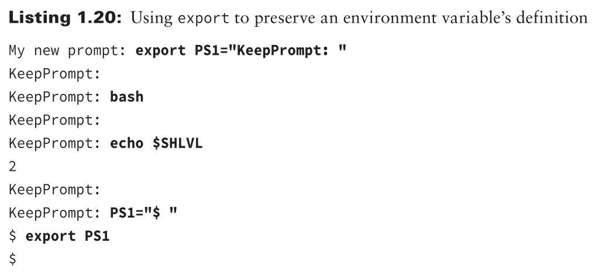

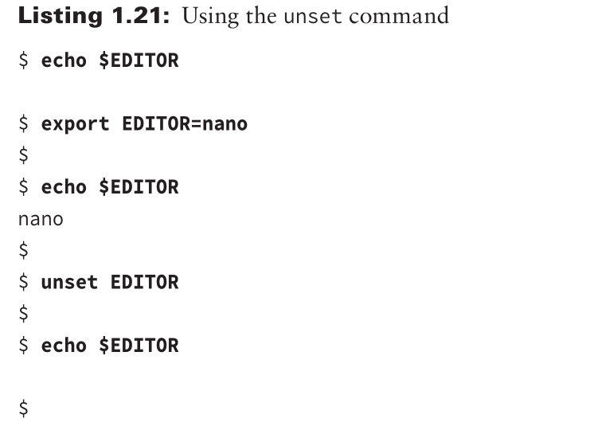

>**Tip:** Use caution when employing the unset command. If you use it on environment variables, such as `PS1`, you can cause confusing things to happen. If the variable had a different definition before you modified it, it is best to change it back to its original setting instead of using unset on the variable.

>**Tip:** If you use the man pages to read through a built-in command’s documentation, you’ll reach the General Commands Manual page for Bash built-ins. It can be tedious using keys to find a command in this page. Instead, type `/` and follow it with the command name. You may have to do this two or three times to reach the utility’s documentation, but it is much faster than continually pressing arrow or PageDown keys.

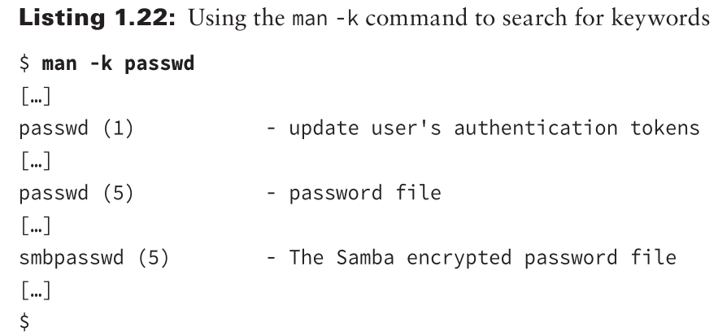

example:
```
man 8 chpasswd
```

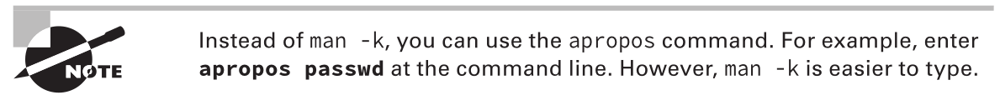

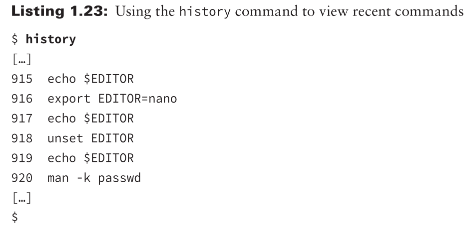

Notice that each command is preceded by a number. This allows you to recall a command from your history list via its number and have it automatically executed;

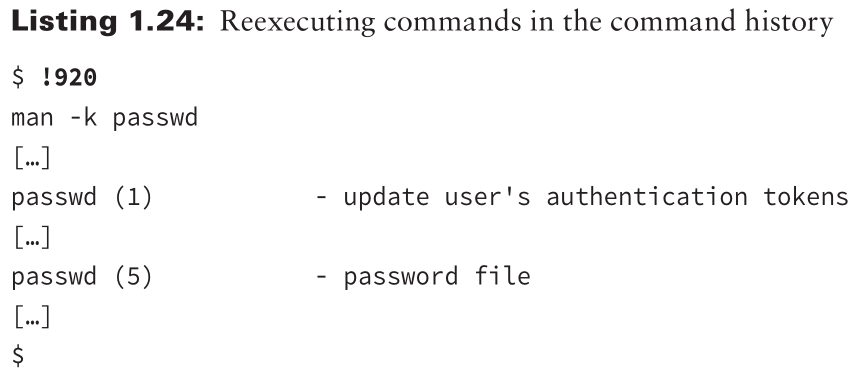

Note that in order to rerun the command, you must put an exclamation mark (!) prior to the number. The shell will display the command you are recalling and then execute it, which is handy.

To reexecute your most recent command, enter `!!` at the command line and press Enter. A faster alternative is to press the *up arrow* key and then press Enter. Another advantage of this last method is that you can edit the command as needed prior to running it.

The history list is preserved between login sessions in the file designated by the `$HISTFILE` environment variable. It is typically the **.bash_history** file in your home directory;
```
echo $HISTFILE
```

Keep in mind that the history file will not have commands you have used during your current login session. These commands are stored only in the history list. If you desire to update the history file or the current history list, you’ll need to issue the history command with the correct option. The following is a brief list of history options to help you make the right choice:
- `-a` appends the current history list commands to the end of the history file.
- `-n` appends the history file commands from the current Bash shell session to the current history list.
- `-r` overwrites the current history list commands with the commands stored in the history file.

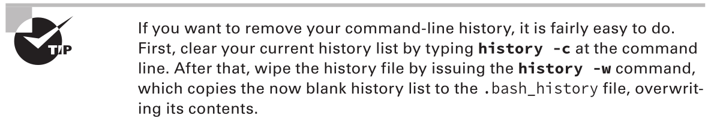

---