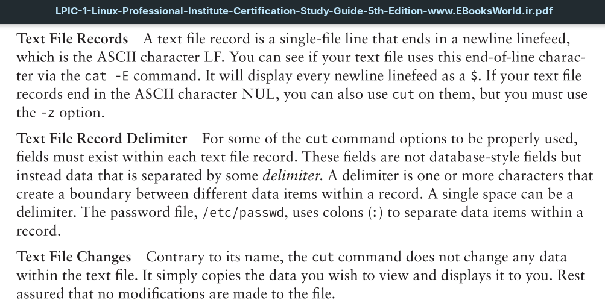
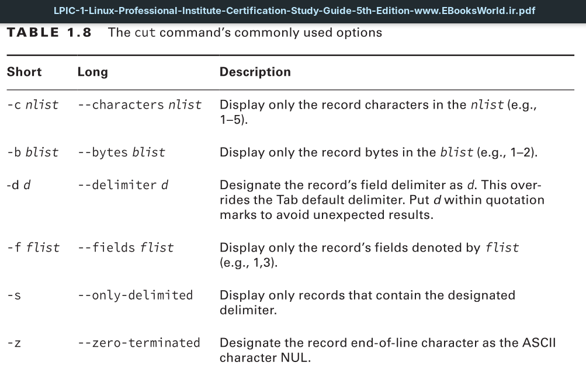
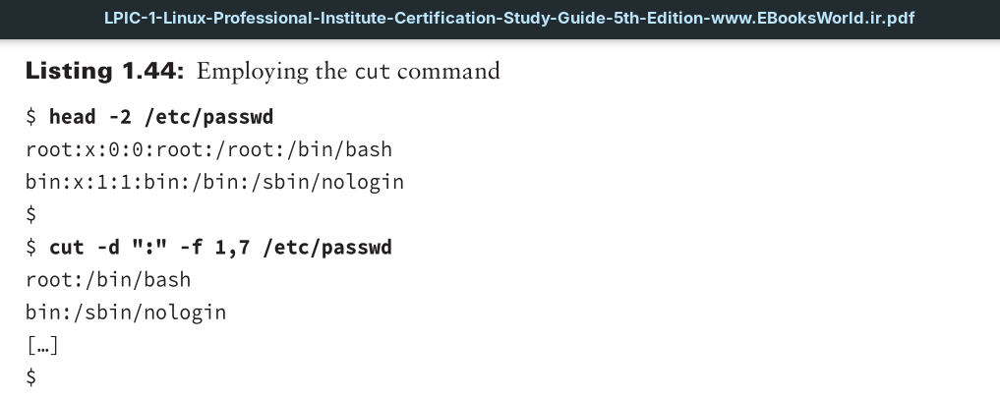
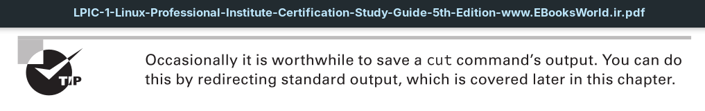

In Listing 1.44, the head command displays the password file’s first two lines. This text file employs colons (:) to delimit the fields within each record. The first use of the cut command designates the colon delimiter using the -d option. Notice the colon is encased in quotation marks to avoid unexpected results. The -f option specifies that only fields 1 (username) and 7 (shell) should be displayed.

