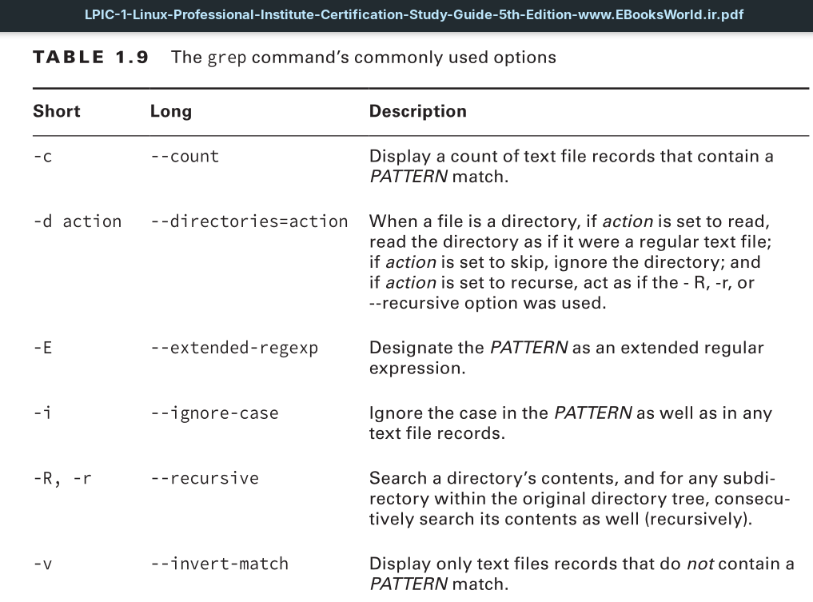
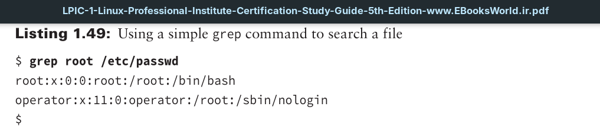
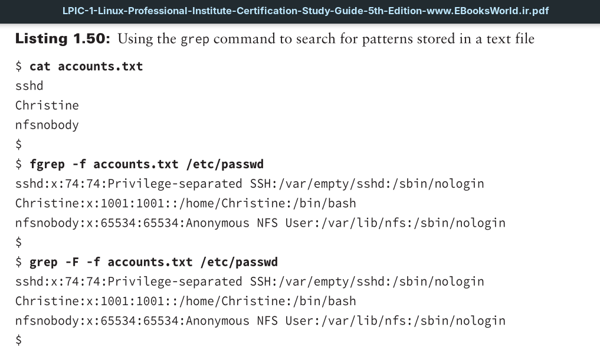

A simple example is shown in Listing 1.49. No options are used, and the grep utility is used to search for the word `root` ( PATTERN) within `/etc/passwd` (FILE).

The patterns are stored in the accounts.txt file, which is first displayed using the cat command. Next, the fgrep command is employed, along with the -f option to indicate the file that holds the patterns. The /etc/passwd file is searched for all the patterns stored within the accounts.txt file, and the results are displayed.
Also notice in Listing 1.49 that the third command is the grep -F command. The grep -F command is equivalent to using the fgrep command, which is why the two commands produce identical results.

