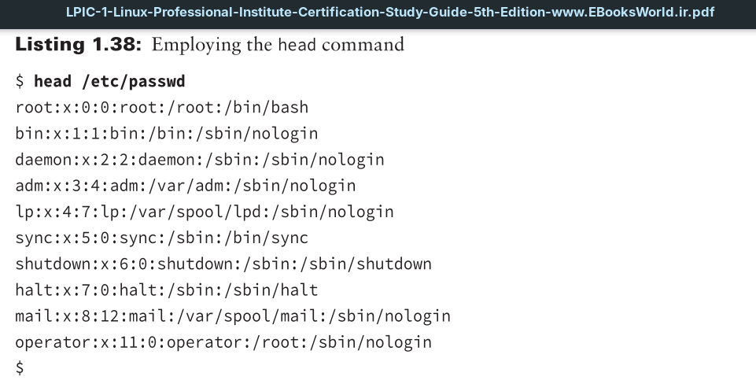
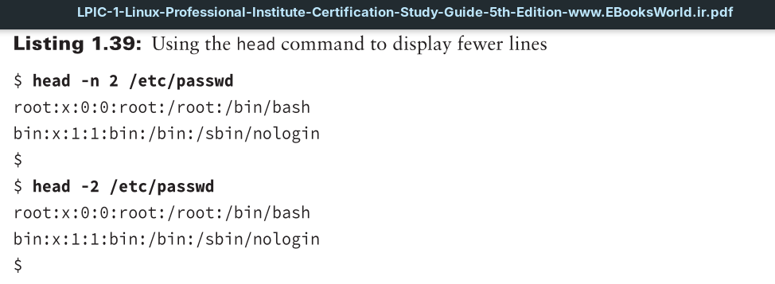

By default, the head command displays the fi rst 10 lines of a text file.

A good command option to try allows you to override the default behavior of only displaying a file’s first 10 lines. The switch to use is -n (or --lines=), followed by an argument.

