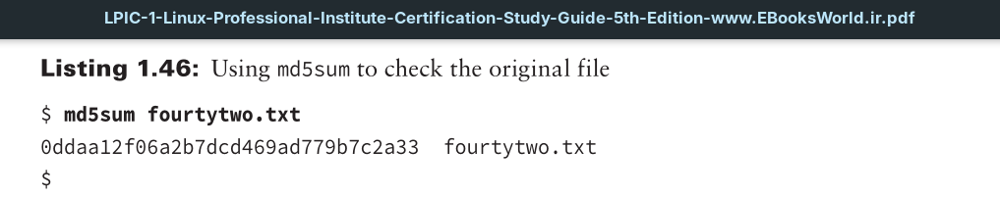
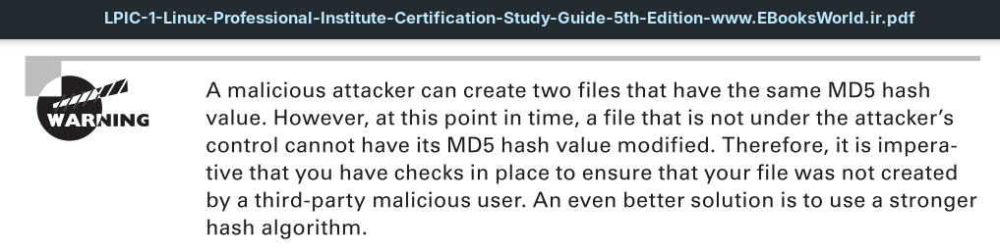

The `md5sum` utility is based on the MD5 message-digest algorithm. It was originally created to be used in cryptography. It is no longer used in such capacities due to various known vulnerabilities. However, it is still excellent for checking a file’s integrity.

The md5sum produces a 128-bit hash value. If you copy the file to another system on your network, run the md5sum on the copied file. If you find that the hash values of the original and copied file match, this indicates no file corruption occurred during its transfer.

