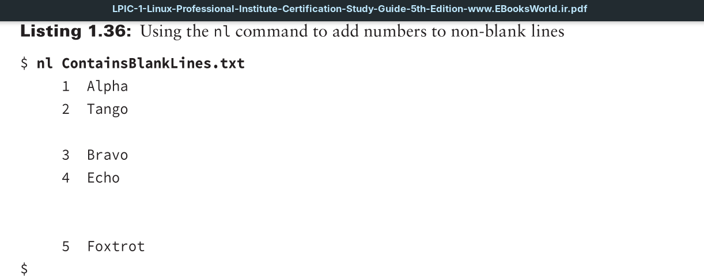
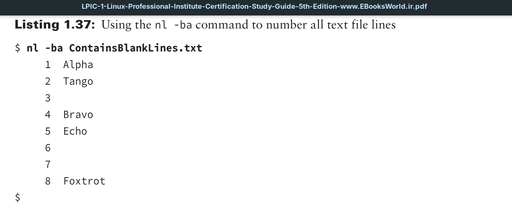
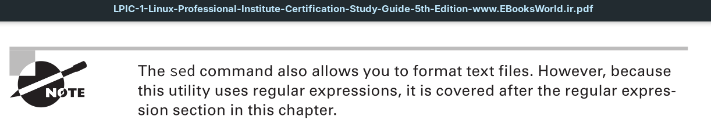

Another useful file-formatting command is the `nl` utility (number line utility). This little command allows you to number lines in a text file in powerful ways. It even allows you to use regular expressions to designate which lines to number.

If you do not use any options with the `nl` utility, it will number only non-blank text lines.



If you would like all file’s lines to be numbered, including blank ones, then you’ll need to employ the -ba switch.





Again you have another power option. You can use `bat`. Just install it and use:
```
bat file
```

