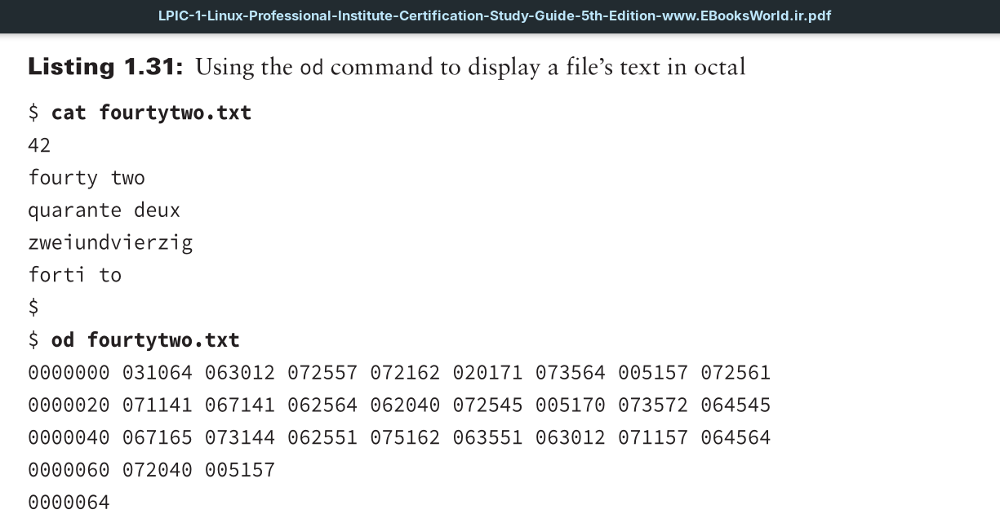
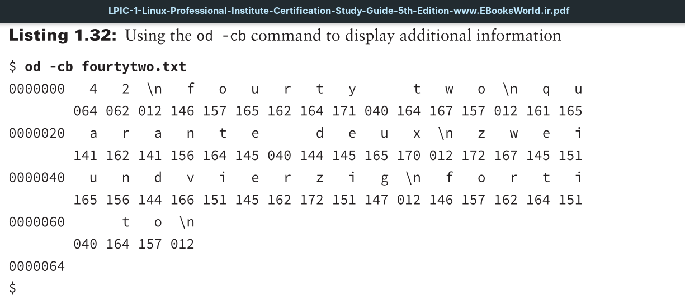

Occasionally you may need to do a little detective work with fi les. These situations may include trying to review a graphics fi le or troubleshooting a text file that has been modified by a program. The `od` utility can help, because it allows you to display a file’s contents in octal (base 8), hexadecimal (base 16), decimal (base 10), and ASCII.
By default `od` displays a file’s text in octal.

