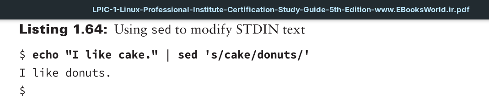
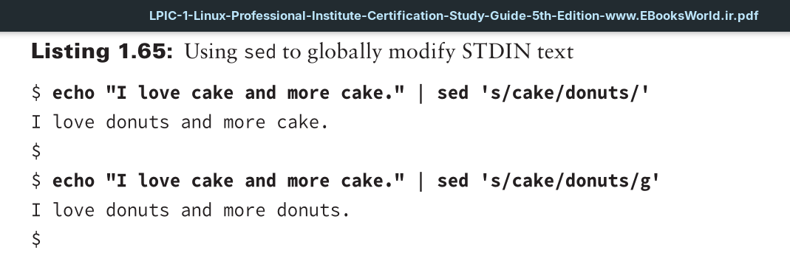
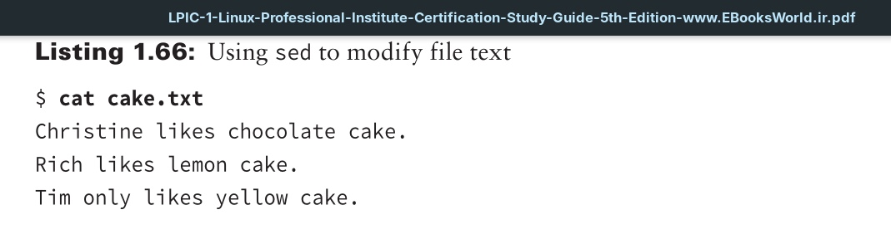
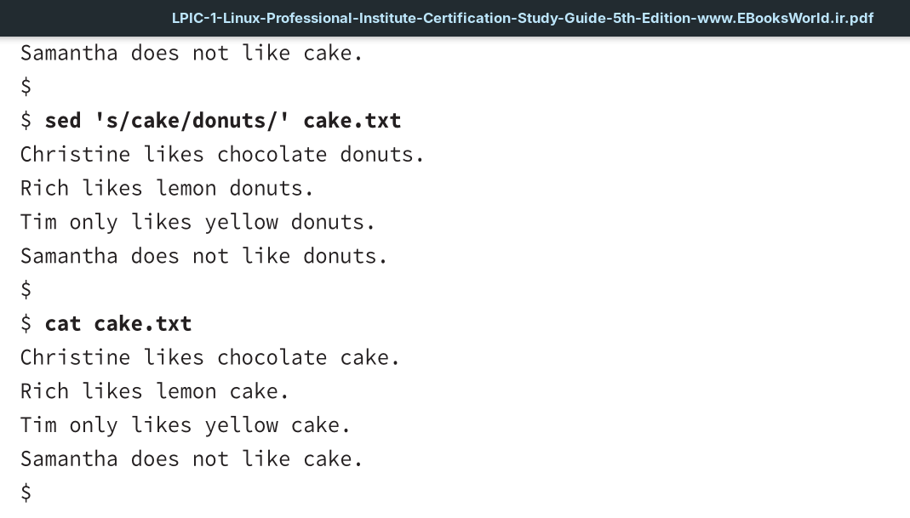
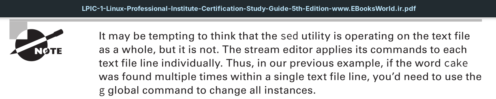
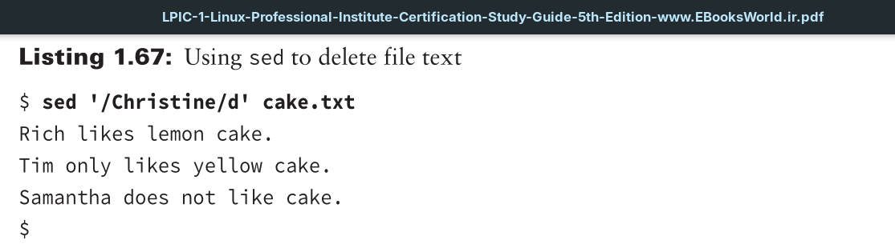
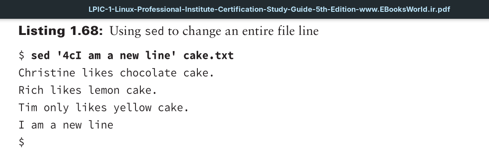
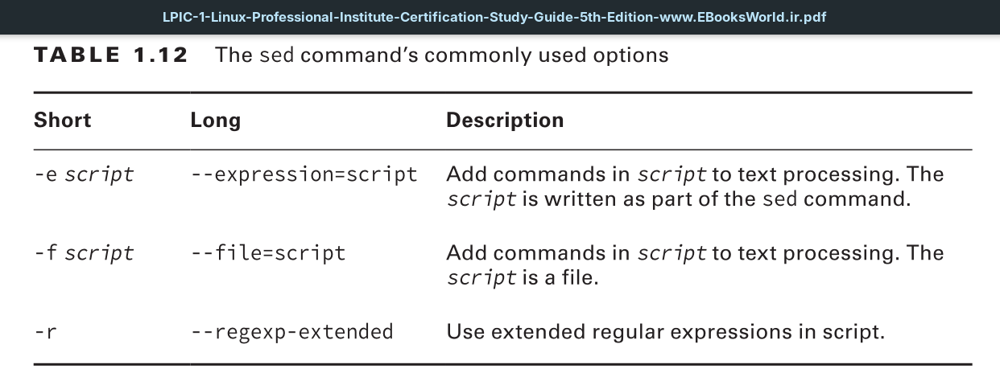
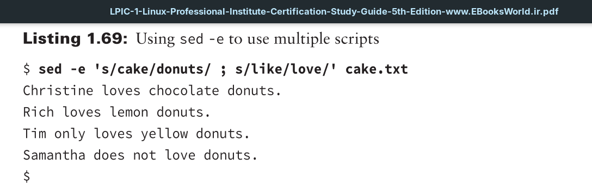

Another interesting command-line program is a stream editor. There are times where you will want to edit text without having to pull out a full-fledged text editor. A stream editor modifies text that is passed to it via a file or output from a pipeline. This editor uses special commands to make text changes as the text “streams” through the editor utility.

The command to invoke the stream editor is `sed`. The `sed` utility edits a stream of text data based on a set of commands you supply ahead of time. It is a very quick editor because it makes only one pass through the text to apply the modifications.

The process the editor goes through is as follows:
1. Reads one text line at a time from the input stream
2. Matches that text with the supplied editor commands
3. Modifies the text as specified in the commands
4. Displays the modified text

After the `sed` editor matches all the specified commands against a text line, it reads the next text line and repeats the editorial process. Once `sed` reaches the end of the text lines, it stops.

By default, `sed` will use the text from `STDIN` to modify it according to the specified commands.

Notice that the text output from the echo command is piped as input into the stream editor. The `sed` utility’s s command (substitute) specifies that if the first text string, cake, is found, it is changed to donuts in the output. Note that the entire command after `sed` is considered to be the SCRIPT, and it is encased in single quotation marks. Also notice that the text words are delimited from the s command, the quotation marks, and each other via the forward slashes (/).
Keep in mind that just using the s command will not change all instances of a word within a text stream.

In the first command in Listing 1.65, only the first occurrence of the word cake was modified. However, in the second command a `g`, which stands for global, was added to the `sed` script’s end. This caused all occurrences of cake to change to donuts.

In Listing 1.66, the file contains text lines that contain the word cake. When the cake.txt file is added as an argument to the `sed` command, its data is modified according to the script. Notice that the data in the file is not modified. The stream editor only displays the modified text to `STDOUT`. You could save the modified text to another file name via a `STDOUT` `redirection` operator, if desired.

So far we’ve shown you only `sed` substitution commands, but you can also delete lines using the stream editor. To do so, you use the syntax of `'PATTERN/d'`for the `sed` command’s SCRIPT.
An example is shown in Listing 1.67. Notice the cake.txt file line that contains the word Christine is not displayed to `STDOUT`. It was “deleted” in the output, but it still exists within the text file.

You can also change an entire line of text. To accomplish this, you use the syntax of `'ADDRESScNEWTEXT'` for the `sed` command’s SCRIPT. The ADDRESS refers to the file’s line number, and the NEWTEXT is the different text line you want displayed.

A handy option to use is the -e option. This allows you to employ multiple scripts in the `sed` command.

the script contains a semicolon (;) between the two script commands. This allows both commands to be processed on the text stream.
