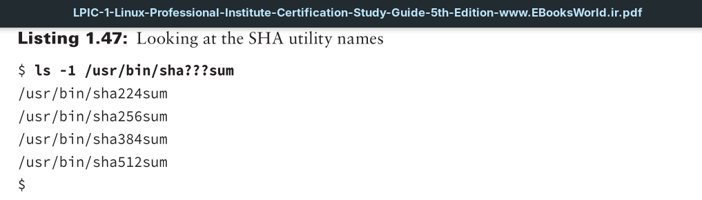
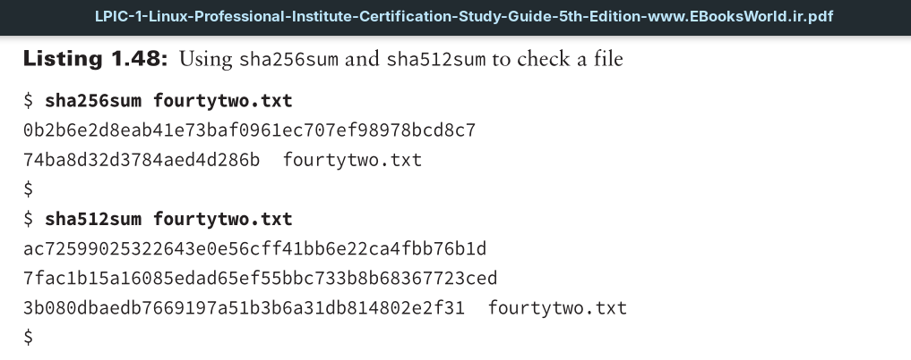

The Secure Hash Algorithms (SHA) is a family of various hash functions. Though typically used for cryptography purposes, they can also be used to verify a file’s integrity after it is copied or moved to another location.
Several utilities implement these various algorithms on Linux.
The quickest way to find them is via the method shown in Listing 1.47. Keep in mind your particular distribution may store them in the `/bin` directory instead.

Each utility includes the SHA message digest it employs within its name. Therefore, sha256sum uses the SHA-256 algorithm. These utilities are used in a similar manner to the md5sum command.

Notice in Listing 1.48 the different hash value lengths produced by the different commands. The sha512sum utility uses the SHA-512 algorithm, which is the best to use for security purposes and is typically employed to hash salted passwords in the `/etc/shadow` file on Linux.

You can use these SHA utilities, just like the md5sum program was used in Listing 1.46, to ensure a file’s integrity when it is transferred. That way, file corruption is avoided as well as any malicious modifications to the file.
