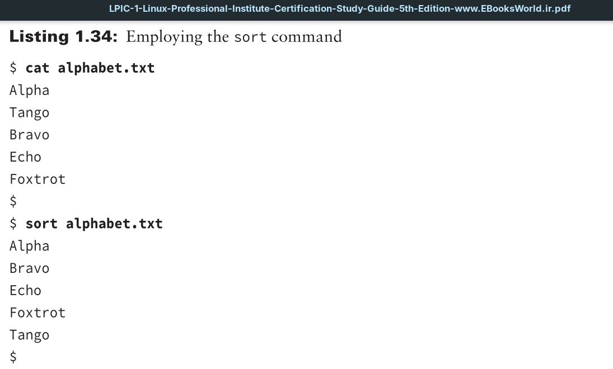
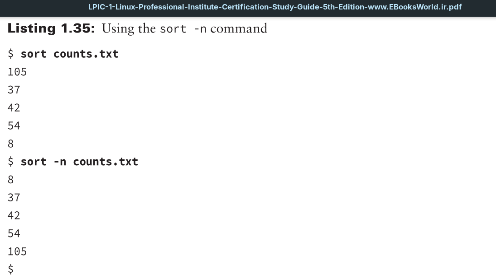
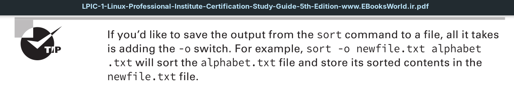

The sort utility sorts a file’s data. Keep in mind that it makes no changes to the original file; only the output is sorted.

If you want to order a file’s content using the system’s standard sort order, enter the sort command followed by the name of the file you wish to sort.

If a file contains numbers, the data may not be in the order you desire using the sort utility. To obtain proper numeric order, add the -n option to the command.

