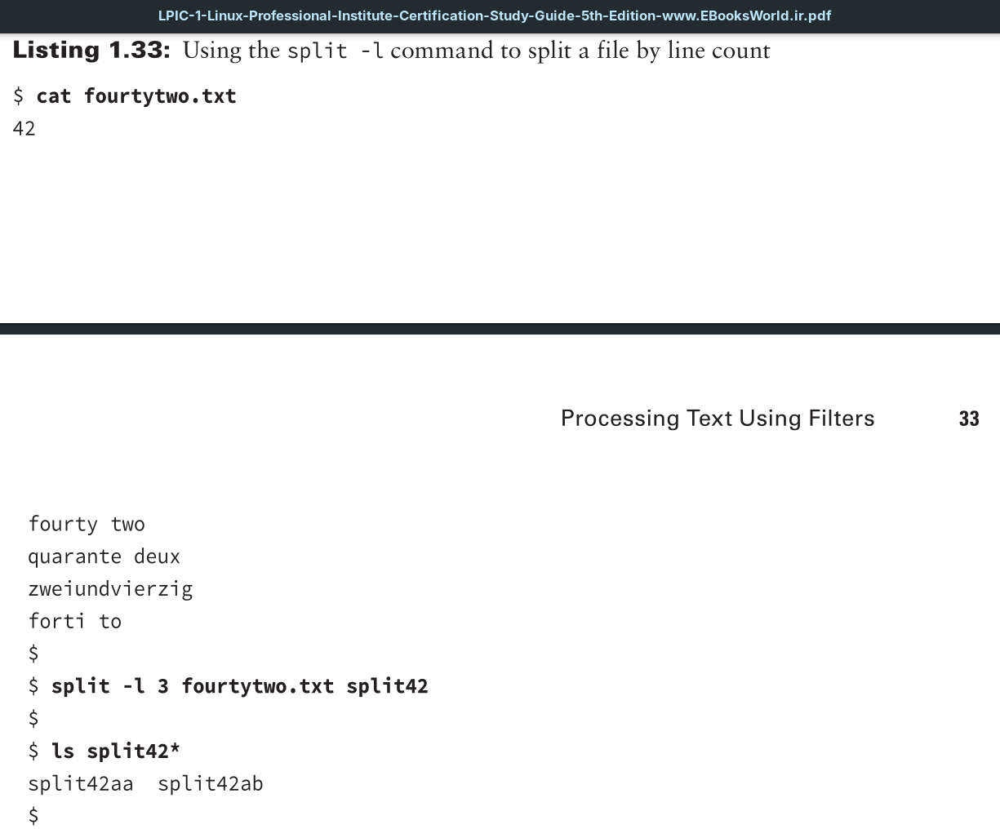
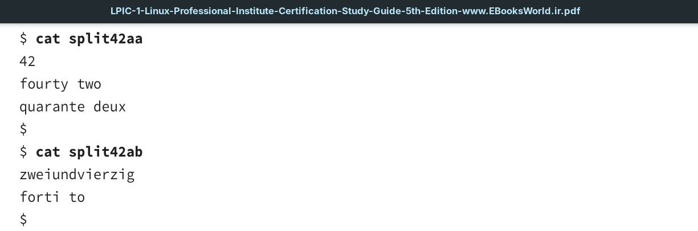

This utility allows you to divide a large file into smaller chunks, which is handy when you want to quickly create a smaller text file for testing purposes.

You can divide up a file using size, bytes, lines, and so on. The original file remains unchanged, and additional new files are created, depending on the command options chosen.

