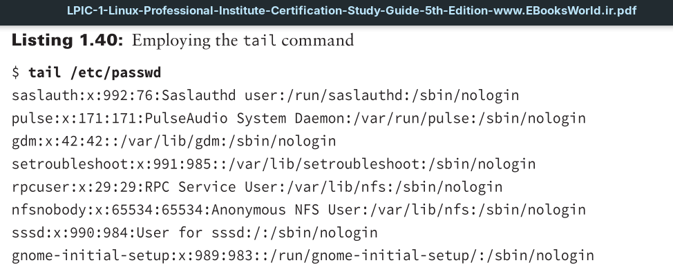
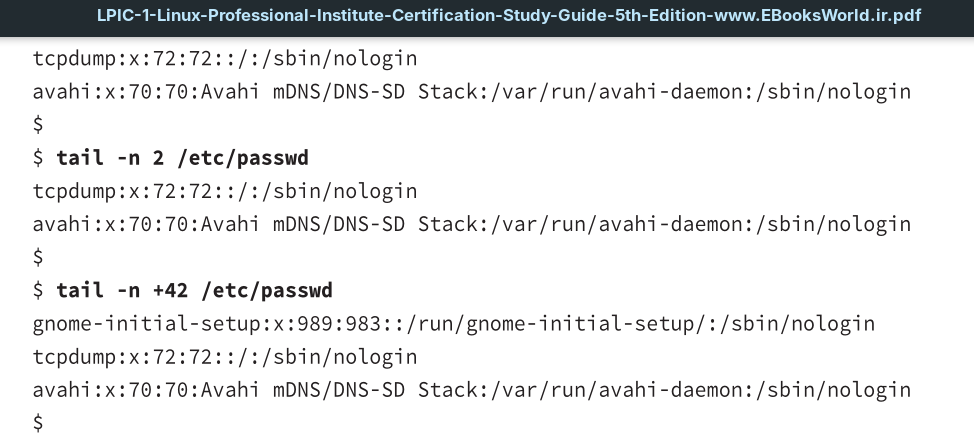
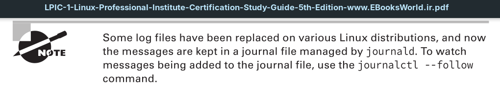
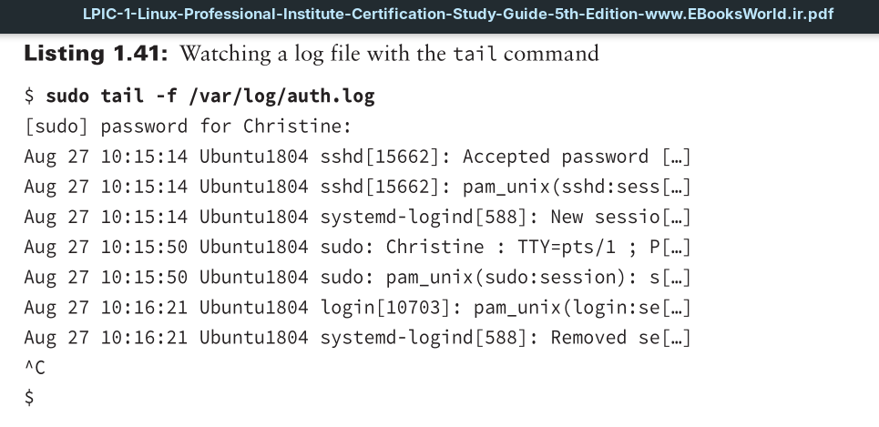
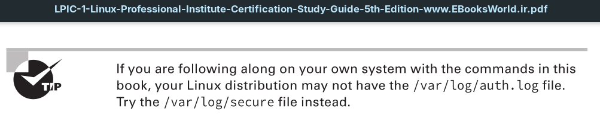

By default, the tail command will show a file’s last 10 text lines. However, you can override that behavior by using the -n (or --lines=) switch with an argument. The argument tells tail how many lines from the file’s bottom to display. If you add a plus sign (+) in front of the argument, the tail utility will start displaying the file’s text lines starting at the designated line number to the file’s end.

One of the most useful tail utility features is its ability to watch log files. Log files typically have new messages appended to the file’s bottom. Watching new messages as they are added is very handy. Use the -f (or --follow) switch on the tail command and provide the log filename to watch as the command’s argument. You will see a few recent log file entries immediately. As you keep watching, additional messages will display as they are being added to the log file.

