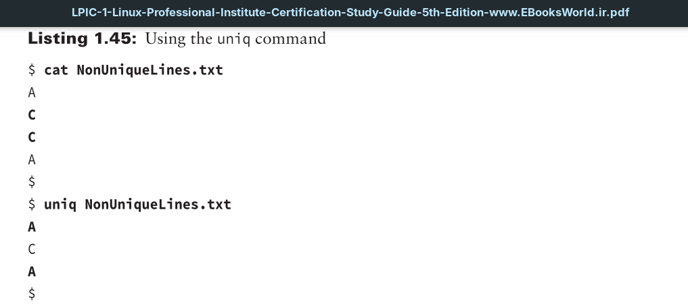

The `uniq` utility will find repeated text lines only if they come right after one another. Used without any options, the command will display only unique (non repeated) lines.

Notice that in the cat command’s output there are actually two sets of repeated lines in this file. One set is the C lines, and the other set is the A lines. Because the `uniq` utility recognizes only repeated lines that are one after the other in a text file, only one of the C text lines is removed from the display. The two A lines are still both shown.

