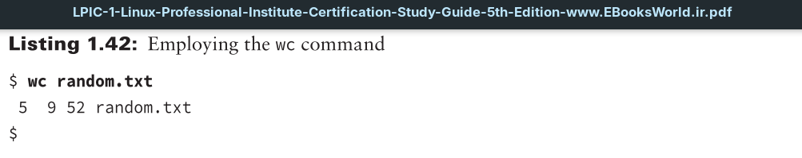
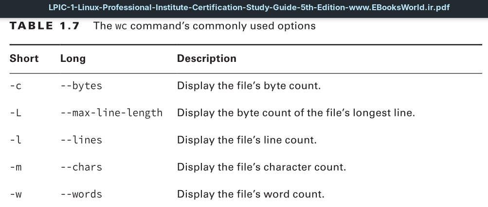
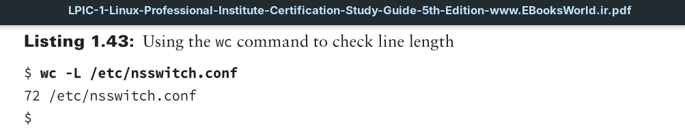

When you issue the `wc` command with no options and pass it a filename, the utility will display the **file’s number of lines**, **words**, and **bytes** in that order.

>An interesting `wc` option for troubleshooting configuration files is the `-L` switch. Generally speaking, line length for a configuration file will be under 150 bytes, though there are exceptions. Thus, if you have just edited a configuration file and that service is no longer working, check the file’s longest line length. A longer than usual line length indicates you might have accidentally merged two configuration file lines.

In Listing 1.43, the file’s line length shows a normal maximum line length of 72 bytes. This `wc` command switch can also be useful if you have other utilities that cannot process text files exceeding certain line lengths.
