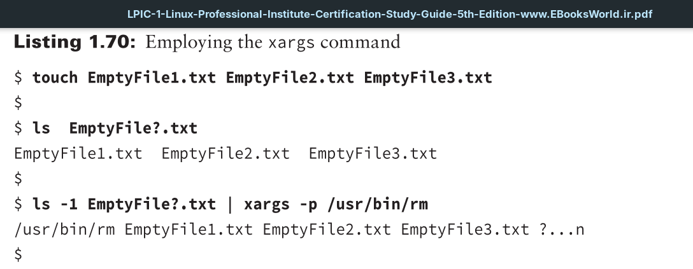
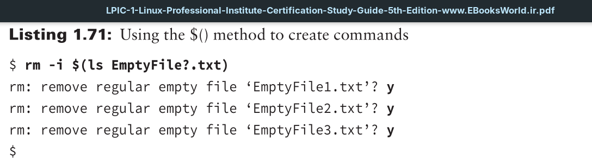

By piping `STDOUT` from other commands into the `xargs` utility, you can build command-line commands on the fly.

 
In Listing 1.70, three blank files are created using the touch command. The third command uses a pipeline. The first command in the pipeline lists any files that have the name EmptyFilen.txt. The output from the ls command is piped as `STDIN` into the `xargs` utility. The `xargs` command uses the -p option. This option causes the `xargs` utility to stop and ask permission before enacting the constructed command-line command. Notice that the absolute directory reference for the rm command is used (the rm command is covered in more detail in Chapter 4). This is sometimes needed when employing `xargs`, depending on your distribution.

In Listing 1.71, the ls command is again used to list any files that have the name EmptyFilen.txt. Because the command is encased by the `$()` symbols, it does not display to `STDOUT`. Instead, the filenames are passed to the `rm -i` command, which inquires as whether or not to delete each found file. This method allows you to get very creative when building commands on the fly.
