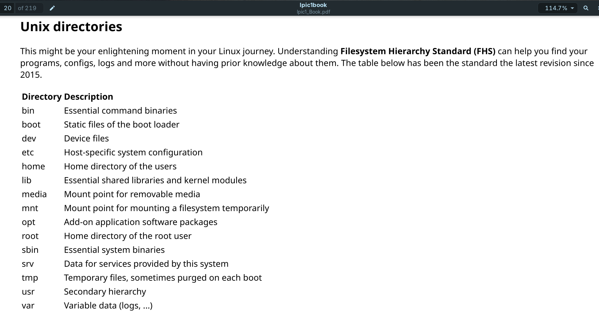

The Advanced Package Tool (APT) suite is used for working with Debian repositories. This includes the apt-cache program that provides information about the package database, and the apt-get program that does the work of installing, updating, and removing packages.

The APT suite of tools relies on the `/etc/apt/sources.list` file to identify the locations of where to look for repositories. By default, each Linux distribution enters its own repository location in that file. However, you can include additional repository locations if you install third-party applications not supported by the distribution.

