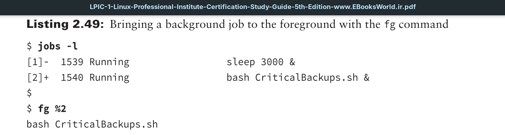

You don’t have to leave your running programs in the background. If desired, you can return them to foreground mode. To accomplish this, use the `fg` command and the background job’s number, preceded by a percent sign (`%`).

The downside to moving a job back into foreground mode is you now have your terminal session tied up until the program completes.

