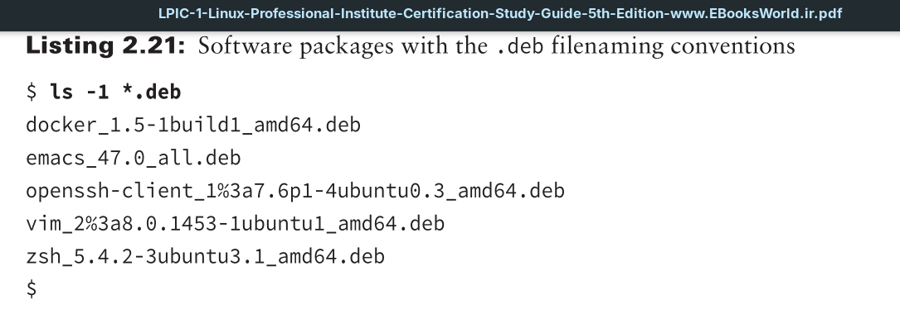
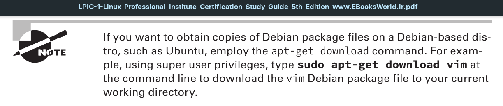

Debian bundles application files into a single `.deb` package file for distribution that uses the following filename format:
`PACKAGE-NAME-VERSION-RELEASE_ARCHITECTURE.deb`

This filenaming convention for `.deb` packages is very similar to the `.rpm` file format. However, in the ARCHITECTURE, you typically find amd64, denoting it was optimized for the AMD64/Intel64 CPU architecture. Sometimes `all` is used, indicating the package is architecturally neutral.

Keep in mind that packaging naming conventions are acceptable standards, but (within limits) do not have to be followed by the package developer. Thus, you may encounter variations.

