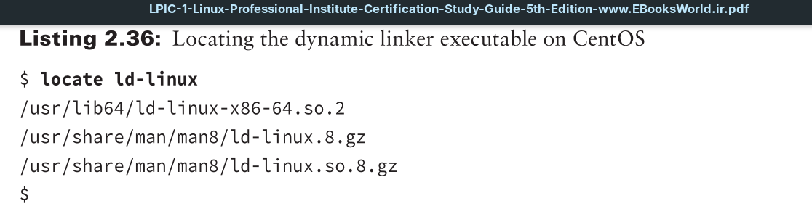
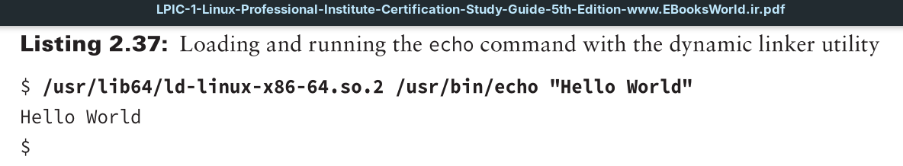

When a program is started, the **dynamic linker** (also called the *dynamic linker/loader*) is responsible for finding the program’s needed library functions. After they are located, the dynamic linker will copy them into memory and bind them to the program.

Historically, the dynamic linker executable has a name like `ld.so` and `ld linux.so*`, but its actual name and location on your Linux distribution may vary.

When you’ve located the dynamic linker utility, you can try it out by using it to manually load a program and its libraries (it will run the program as well).

Unfortunately in Listing 2.37, you cannot see all the shared libraries the dynamic linker loaded when it initiated the echo utility. However, if desired, you can use the `ldd` command to view a program’s needed libraries, and it is covered later in this chapter.
