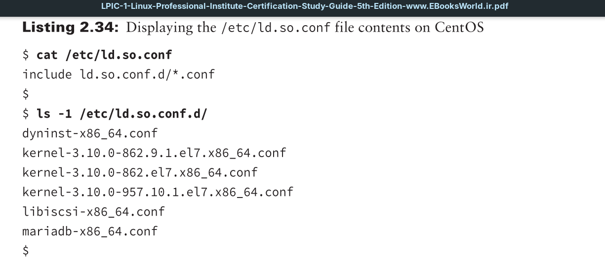
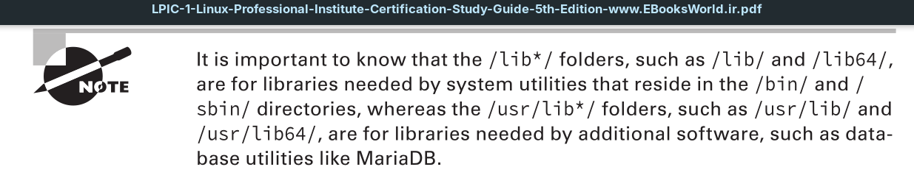
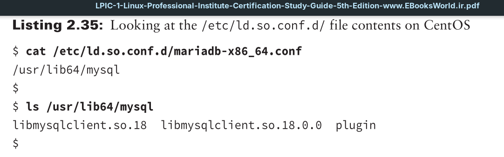

When a program is using a shared function, the system will search for the function’s library file in a specific order; looking in directories stored within the
1. `LD_LIBRARY_PATH environment variable`
2. `Program’s PATH environment variable`
3. `/etc/ld.so.conf.d/ folder`
4. `/etc/ld.so.conf file`
5. `/lib*/ and /usr/lib*/ folders`

Be aware that the order of #3 and #4 may be flip-flopped on your system. This is because the `/etc/ld.so.conf` file loads configuration files from the `/etc/ld.so.conf.d/` folder.

If another library is located in the `/etc/ld.so.conf` file and it is listed above the include operation, then the system will search that library directory before the files in the `/etc/ld.so.conf.d/` folder. This is something to keep in mind if you are troubleshooting library problems.

If you peer inside one of the files within the `/etc/ld.so.conf.d/` folder, you’ll find that it contains a shared library directory name. Within that particular directory are the shared library files needed by an application.

