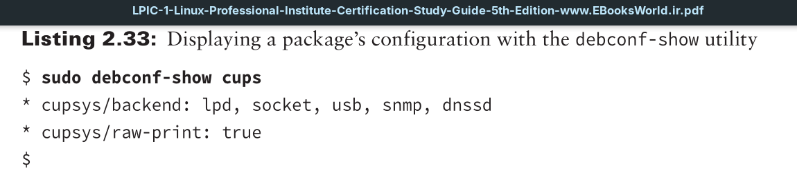
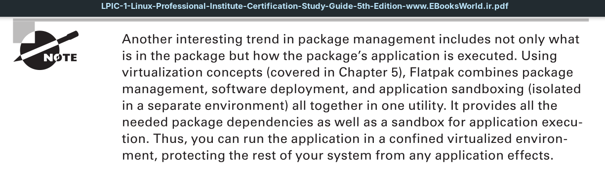

Typically everyone needs to modify configuration files to meet the needs of their system and users. However, if you make changes that cause serious unexpected problems, you may want to return to the package’s initial installation state.
If the package required configuration when it was installed, you are in luck! Instead of purging the package and reinstalling it, you can employ the handy **dpkg reconfigure tool**.
To use it, just type the command, followed by the name of the package you need to reconfigure.

For example, if you needed to fix the cups (printing software covered in
Chapter 6) utility, you would enter:
`sudo dpkg-reconfigure cups`
This command will throw you into a text-based menu screen that will lead you through a series of simple configuration questions.

It’s a good idea to employ the `debconf-show` utility, too. This tool allows you to view the package’s configuration.

It would be worthwhile to run the `debconf-show` command and record the settings before and after running the `dpkg-reconfigure` utility. That way, you’ll have documentation on the configuration before and after the package is reconfigured.

