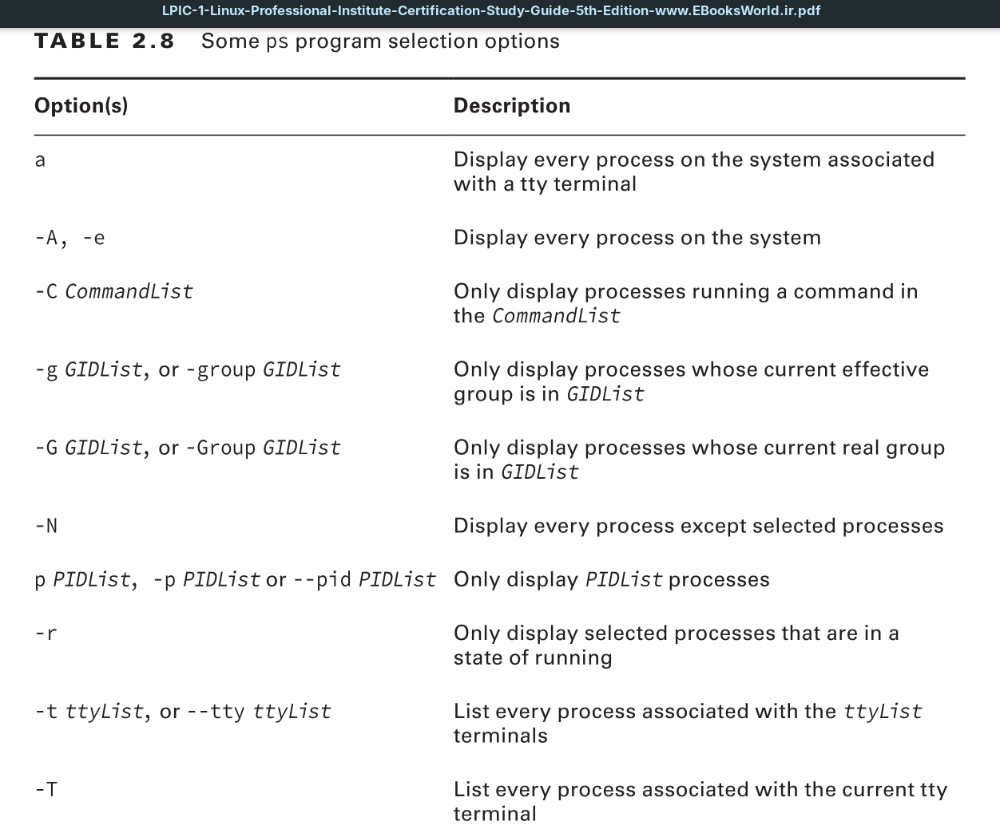
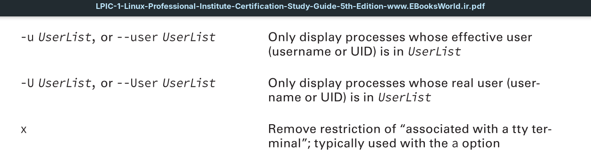
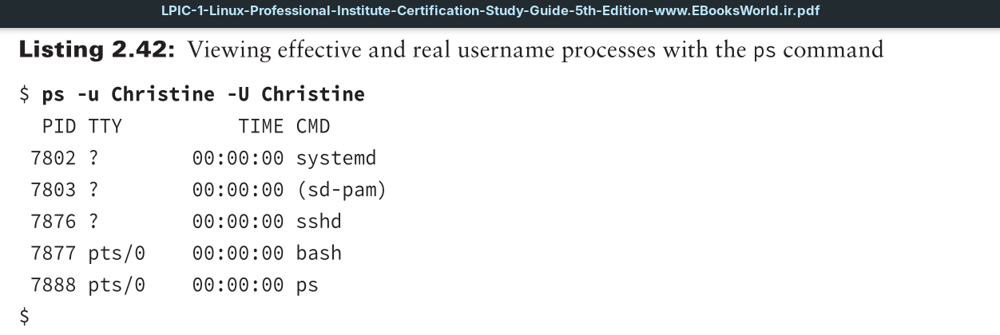

When troubleshooting or monitoring a system, it’s helpful to narrow the `ps` utility’s focus by viewing only a selected subset of processes. You may just want to view processes using a particular terminal or ones belonging to a specific group.

