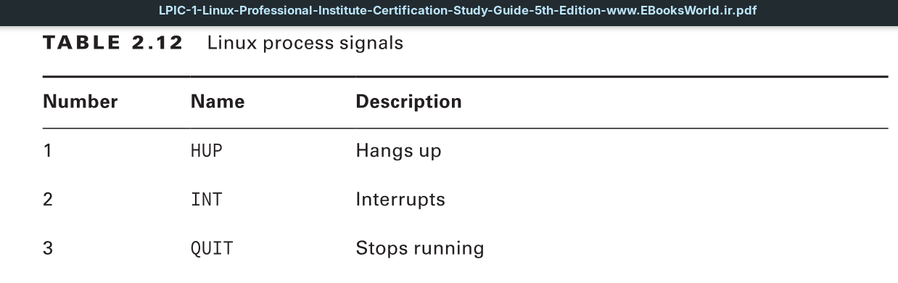
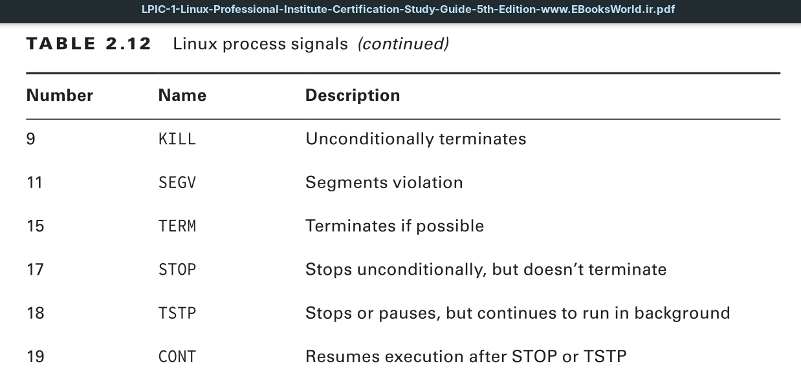

Sometimes a process gets hung up and just needs a gentle nudge to either get going again or stop. Other times, a process runs away with the CPU and refuses to give it up. In both cases, you need a command that will allow you to control a process. To do that, Linux follows the Unix method of interprocess communication.

In Linux, processes communicate with each other using process signals. A process signal is a predefined message that processes recognize and may choose to ignore or act on. The developers program how a process handles signals. Most well-written applications have the ability to receive and act on the standard Unix process signals.

Although a process can send a signal to another process, several commands are available in Linux that allow you to send signals to running processes.

