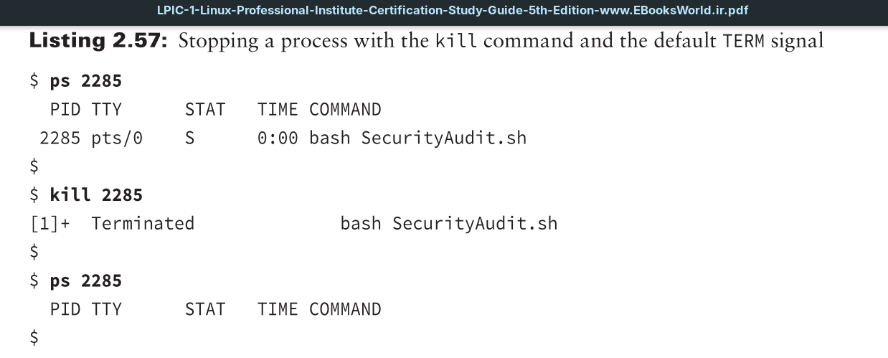
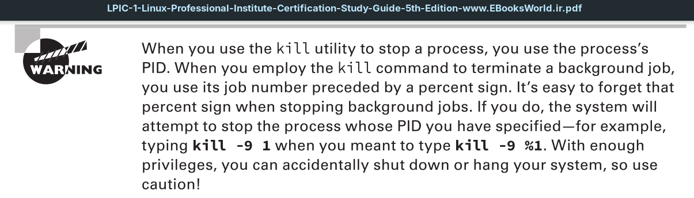
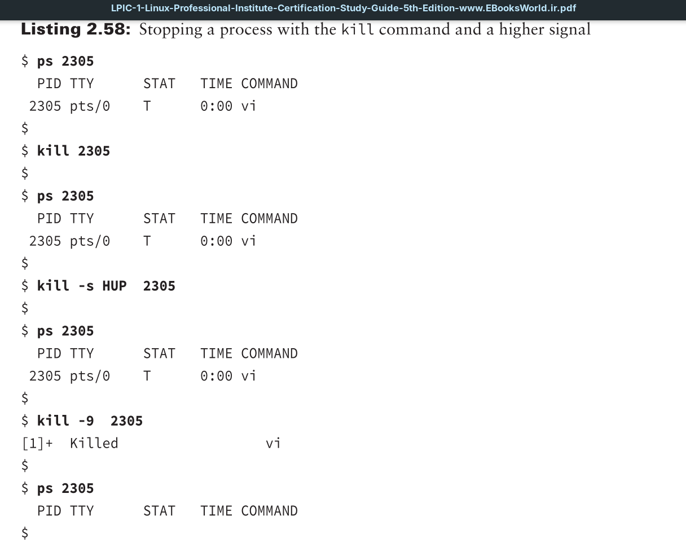

Besides stopping jobs, the kill command allows you to send signals to processes based on their **process ID** (**PID**). By default, the kill command sends a TERM signal to all the **PIDs** listed on the command line.

To send a process signal, you must either be the owner of the process or have super user privileges. The **TERM** signal only asks the process to kindly stop running.

Unfortunately, some processes will ignore the request. When you need to get forceful, the `-s` option allows you to specify other signals (using either their name or signal number). You can also leave off the -s switch and just precede the signal with a dash.

Notice that the process was unaffected by the default `TERM` signal and the `HUP` signal. Thus, kill signal number `9` (`KILL`) had to be employed to stop the process.

