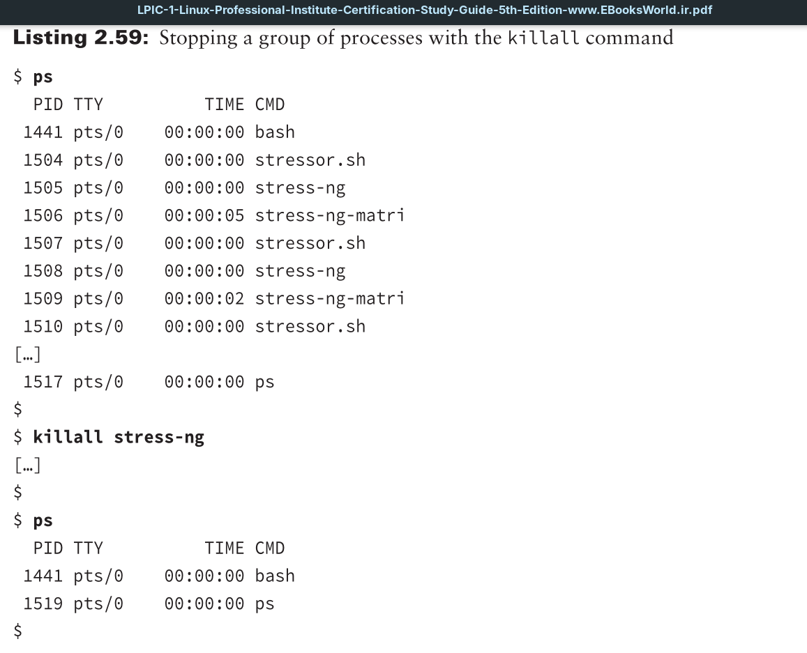
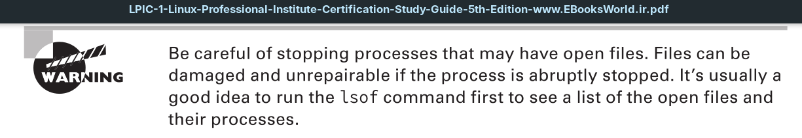

Unfortunately, you can only use the process `PID` instead of its command name, making the `kill` utility difficult to use sometimes. The `killall` command is a nice solution, because it can select a process based on the command it is executing and send it a signal.

The `killall` utility operates similar to `kill` in that if no signal is specified, `TERM` is sent. Also, you can designate a signal using its name or number, and use the  s option or precede the signal with just a dash.

