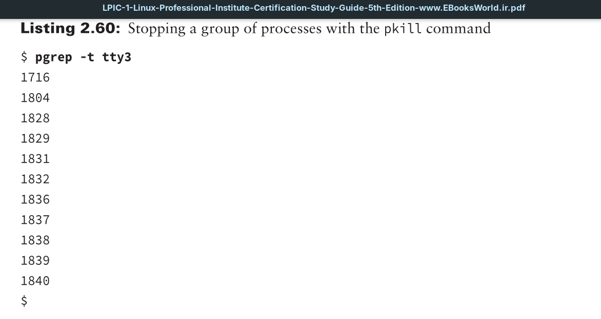
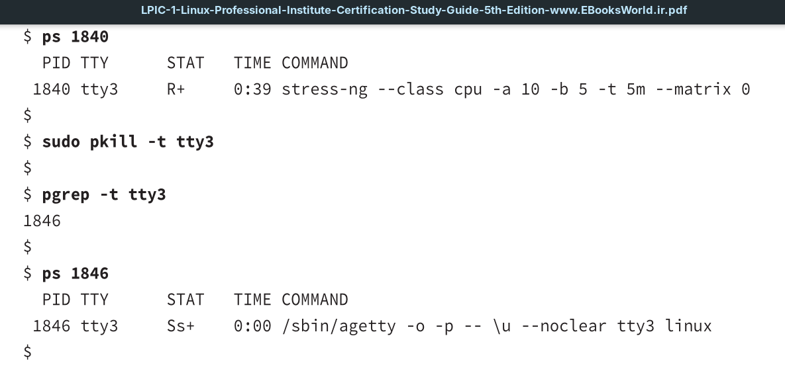

The `pkill` command is a powerful way to send processes’ signals using selection criteria other than their `PID` numbers or commands they are running. You can choose by username, user **ID** (**UID**), terminal with which the process is associated, and so on. In addition, the `pkill` command allows you to use wildcard characters, making it a very useful tool when you’ve got a system that’s gone awry.

Even better, the `pkill` utility works hand-in-hand with the `pgrep` utility. With `pgrep`, you can test out your selection criteria prior to sending signals to the selected processes via `pkill`.

