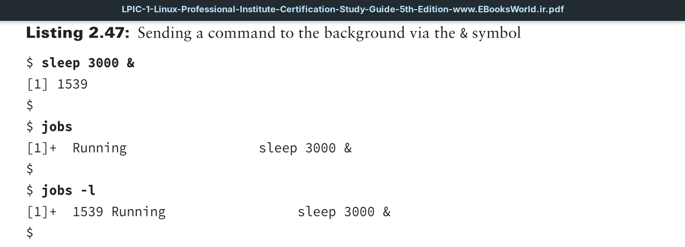
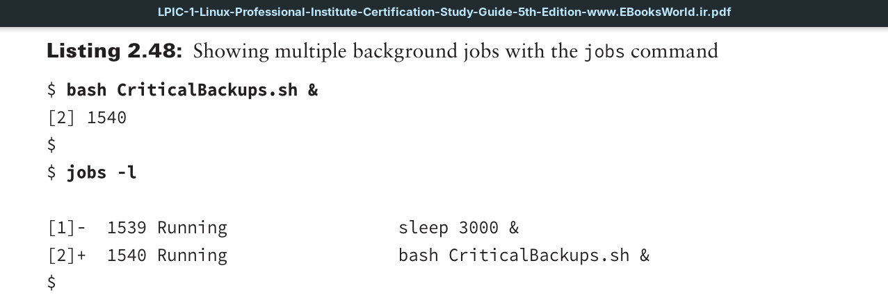

Running a program in **background mode** is a fairly easy thing to do; just place an *ampersand symbol* (`&`) after the command. 

A great program to use for background mode demonstration purposes is the sleep command. This utility is useful for adding pauses in shell scripts. You simply add an argument indicating the number of seconds you wish the script to freeze. Thus, sleep 3 would pause for three seconds.



When you send a command into the background, the system assigns it a job number as well as a `PID`. The job number is listed in brackets, [1], and in the Listing 2.47 example, the background process is assigned a `PID` of 1539. As soon as the system displays these items, a new command-line interface prompt appears. You are returned to the shell, and the command you executed runs safely in background mode.

Notice that in Listing 2.47 the `jobs` command is also employed. This utility allows you to see any processes that belong to you that are running in background mode. However, it displays only the job number. If you need the job’s `PID`, you have to issue the `jobs -l` command.

When the background process finishes, it may display a message on the terminal similar to:
```
[1]+ Done         sleep 3000
```
This shows the job number and the status of the job (Done), along with the command that ran in the background.



The second program sent to the background is a shell script (shell scripts are covered in Chapter 9) that performs important backups. This may take a while to run, so it is sent to the background and assigned the 2 job number.
In Listing 2.48, notice the plus sign (+) next to the new background job’s number. It denotes the last job added to the background job stack. The minus sign (-) indicates that this particular job is the second-to-last process, which was added to the job stack.