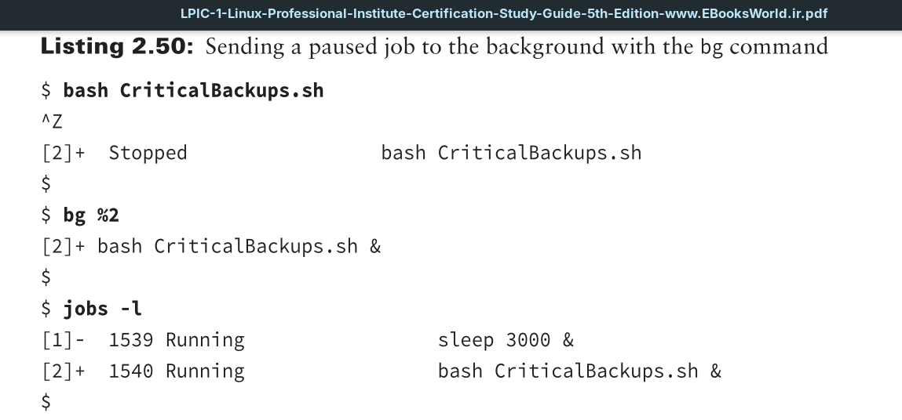

If you have started a program in foreground mode and realize that it will take a while to run, you can still send it to background mode. First you must pause the process using the `Ctrl+Z` key combination; this will stop (pause) the program and assign it a job number.

After you have the paused program’s job number, employ the `bg` command to send it to the background.

Thus, you can send programs to run in background mode before they are started or after they are initiated.

