The core tool to use for handling `.deb` files is the `dpkg` program, which is a command-line utility that has options for installing, updating, and removing `.deb` package files on your Linux system.

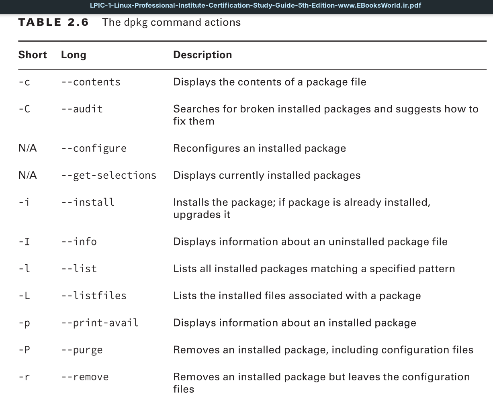

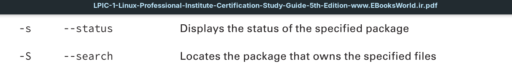

Each action has a set of options that you can use to modify its basic behavior, such as forcing the overwrite of an already installed package or ignoring any dependency errors. To use the `dpkg` program, you must have the .deb software package available on your system. Often you can find .deb versions of application packages ready for distribution on the application website. Also, most distributions maintain a central location for packages to download.

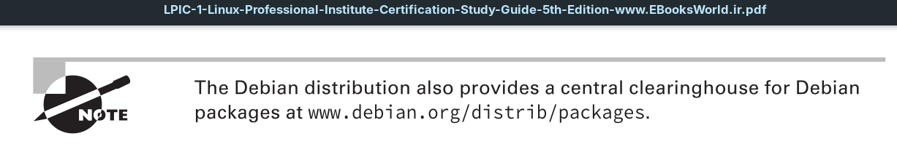

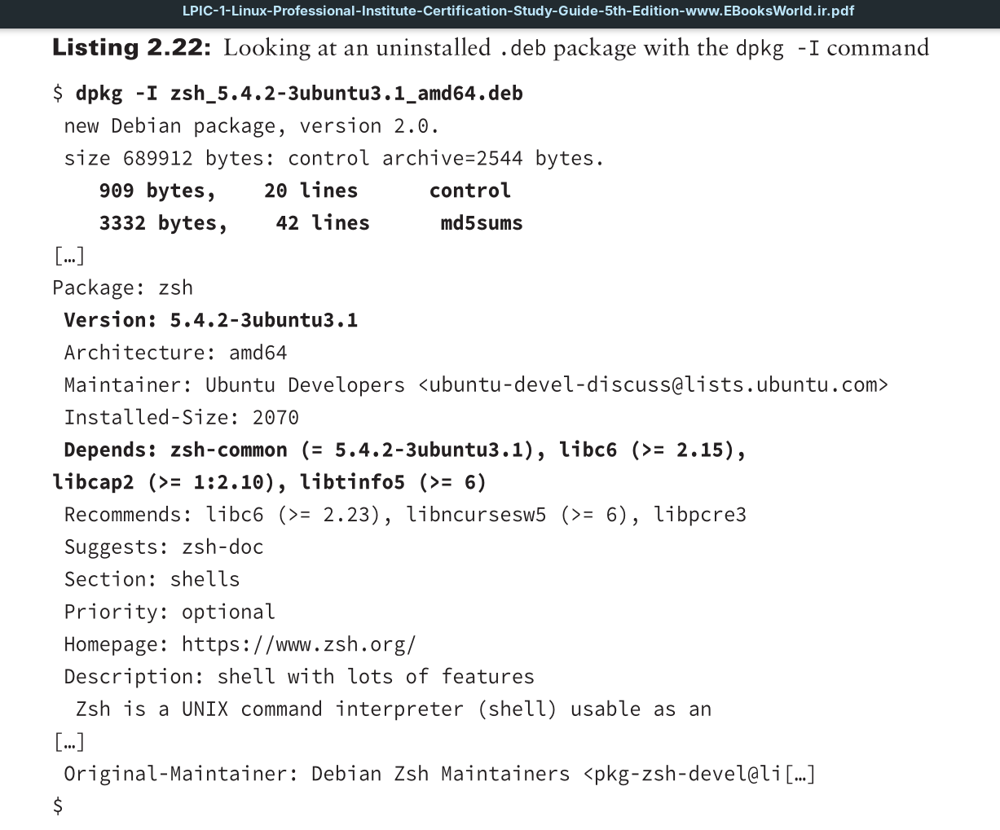

If you want to see the package file’s contents, replace the `-I` option with the `--contents` switch. Be aware that you may need to pipe the output into a pager utility (see Chapter 1) for easier viewing.
When you determine you’ve got the right package, use `dpkg` with the `-i`action to install it, as shown in Listing 2.23. (Be aware that if the software is already installed, this process will upgrade it to the version in the package file.)

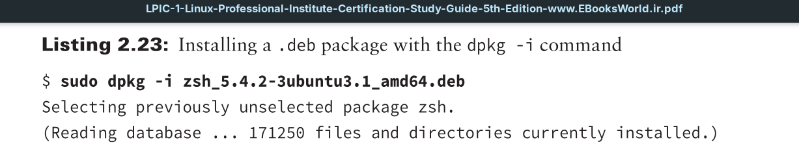

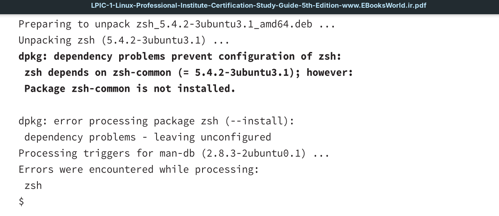

You can see in this example that the package management software checks to ensure that any required packages are installed and produces an error message if any are missing. This gives you a clue as to what other packages you need to install.
After installation you can view the package’s status via the `dpkg -s` command.

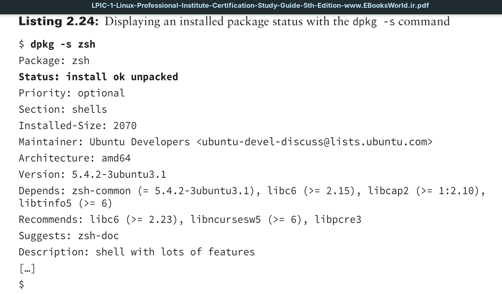

If you’d like to see all of the packages installed on your system, use the `-l` (lowercase L) option.

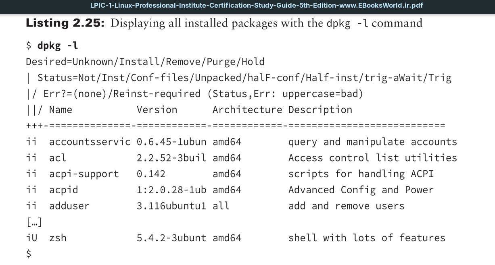

Notice in Listing 2.25 that the installed packages have a status code before their name. The possible package status codes are shown in the first few lines as output by the `dpkg` command. For example, the last line that shows the `zsh` package displays the `iU` code. This means that while the package is installed (i), it is unpacked (U), but not configured, which is a problem.

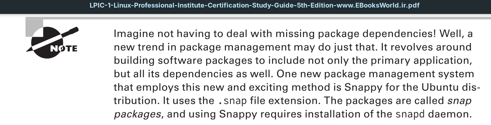

For missing dependency problems, you can quickly check whether a particular package or library is installed via the `dpkg -s` action.

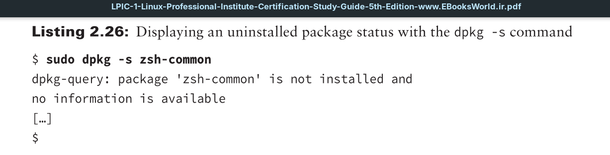

If you need to remove a package, you have two options. The `-r` action removes the package but keeps any configuration and data files associated with the package installed. This is useful if you’re just trying to reinstall an existing package and don’t want to have to reconfigure things.
If you really do want to remove the entire package, use the `-P` option, which purges the entire package, including configuration files and data files from the system.

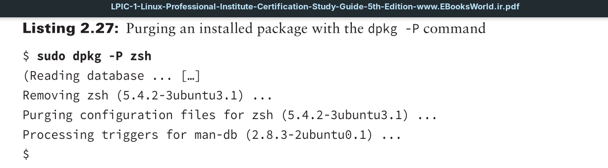

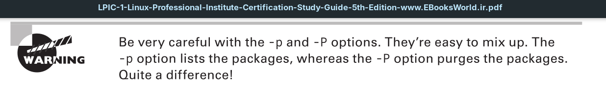

The `dpkg` tool gives you direct access to the package management system, making it easier to install and manage applications on your Debian-based system.