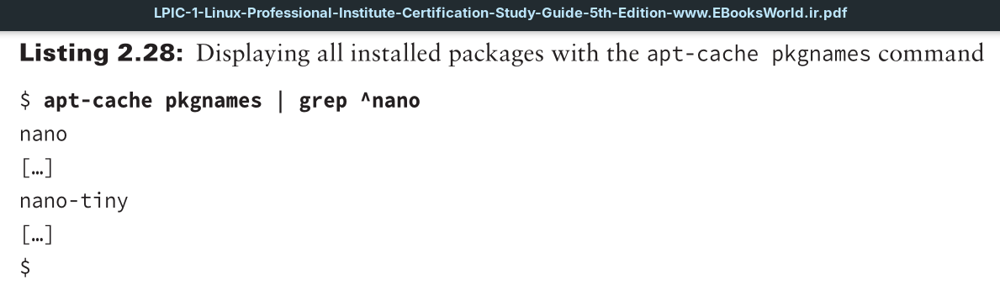
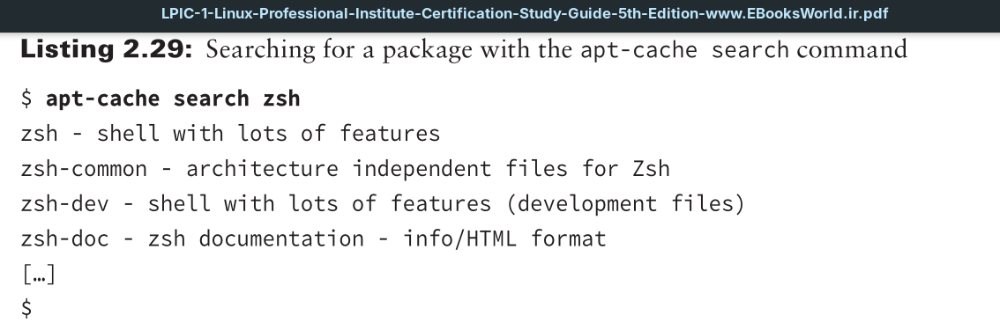
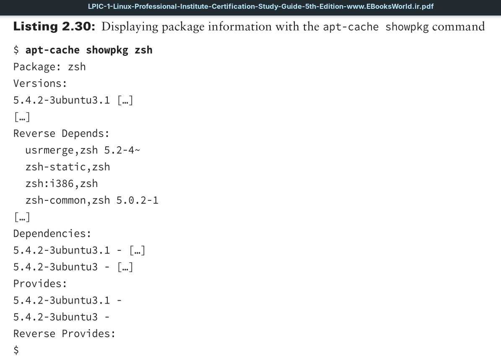

Here are a few useful command options in the apt-cache program for displaying information about packages:
- **depends**: Displays the dependencies required for the package
- **pkgnames**: Shows all the packages installed on the system
- **search**: Displays the name of packages matching the specified item
- **showpkg**: Lists information about the specified package
- **stats**: Displays package statistics for the system
- **unmet**: Shows any unmet dependencies for all installed packages or the specified installed package

Typically you can issue the `apt-cache` commands without employing super user privileges. One handy command is `apt-cache pkgnames`, which displays all installed Debian packages on the system.

If you need to look for a particular package to install, the `apt-cache search` command is useful.

When you have found the desired package, peruse its detailed information via the `apt-cache showpkg` command.

The `apt-cache` utility provides several ways to discover package information. But you need another program to handle other package management functions.
