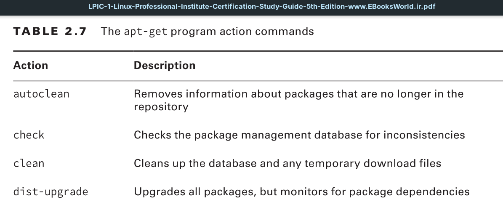
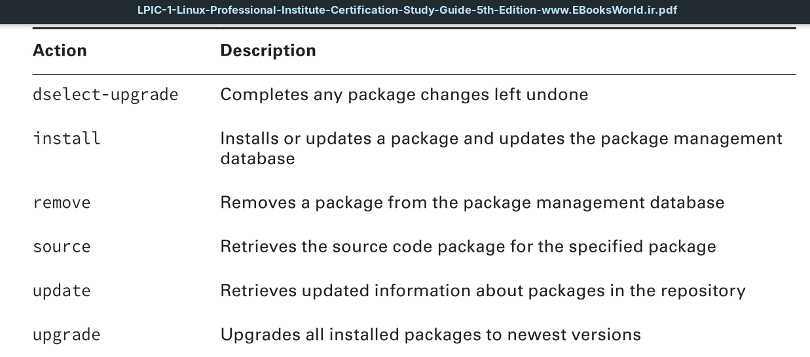
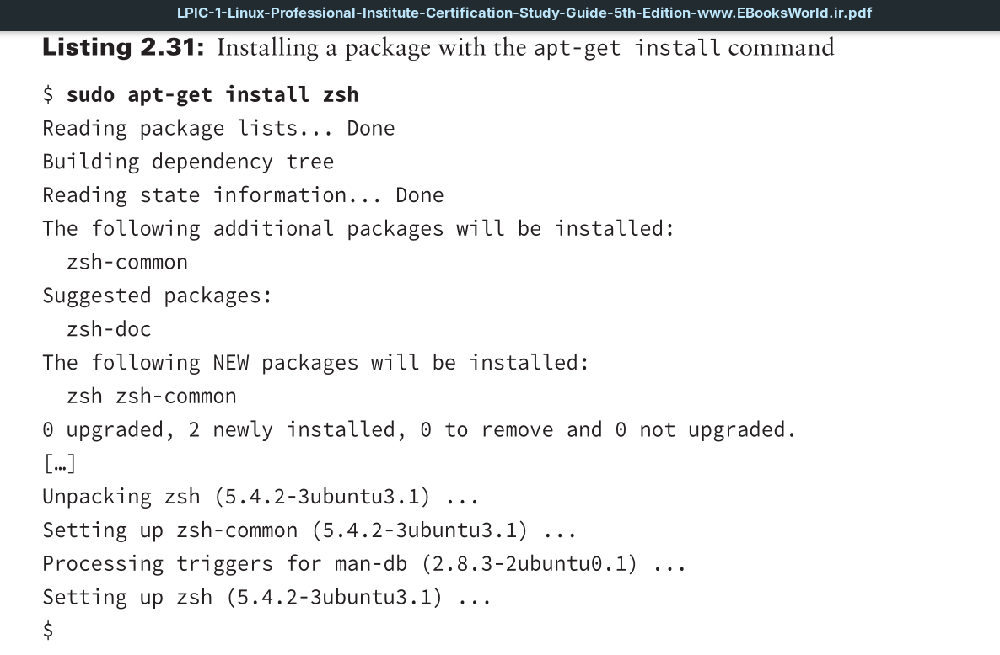
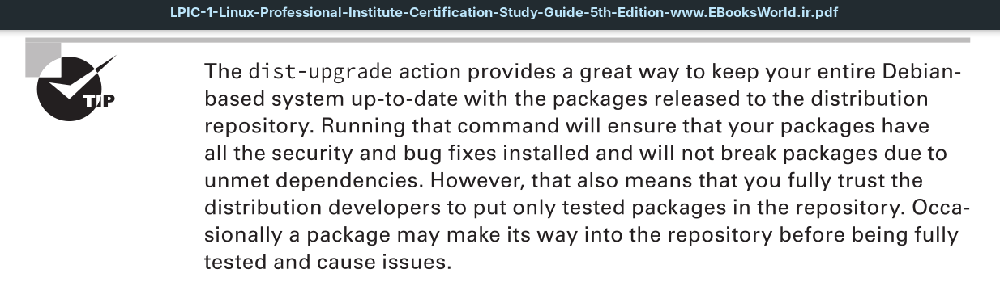
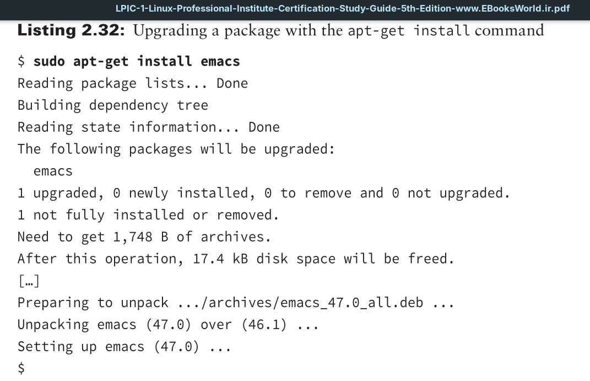
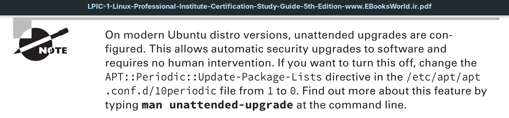

The workhorse of the APT suite of tools is the `apt-get` program. It’s what you use to install, update, and remove packages from a Debian package repository.

If any dependencies are required, the `apt-get` program retrieves those as well and installs them automatically.

The install action does more than install packages. You can upgrade individual packages as well.

The APT suite is helpful in taking care of software package management. You just need to remember when to use `apt-cache` and when to use `apt-get`.

