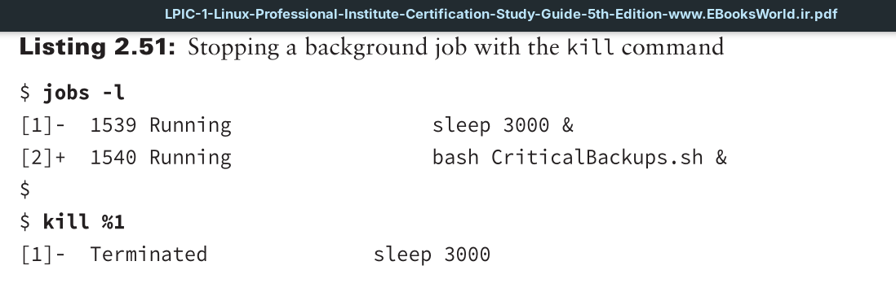
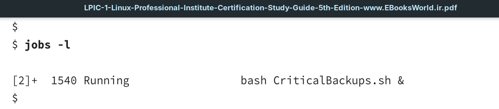
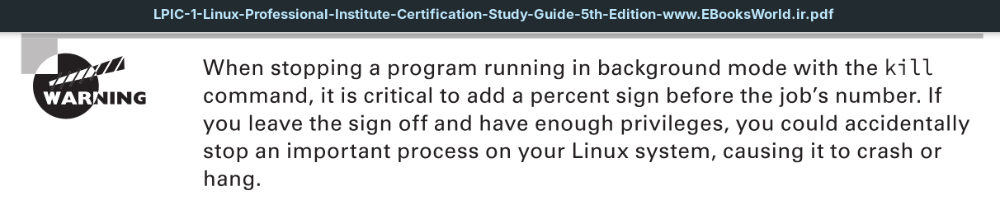

Stopping a background job before it has completed is fairly easy. It’s accomplished with the `kill` command and the job’s number.

Notice that with the `kill` command, the background job’s number is preceded with a percentage sign (`%`). When the command is issued, a message indicating the job has been eradicated is displayed (terminated or killed). You should confirm this by reissuing the jobs command. Be aware that some background jobs need a stronger method to remove them. This topic is covered later in this chapter.

