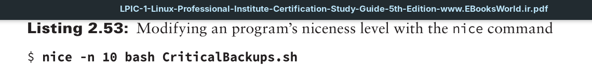
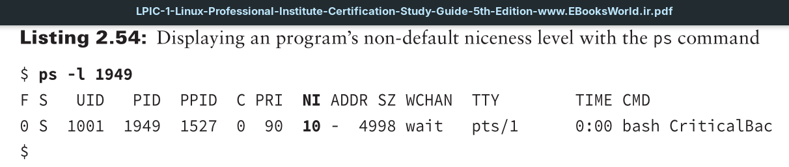
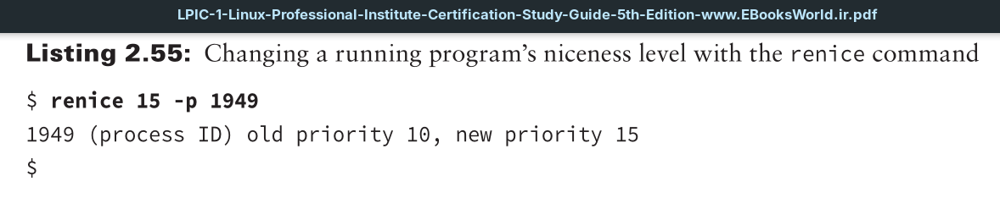
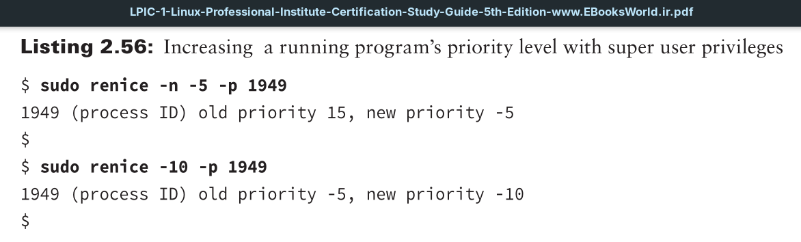
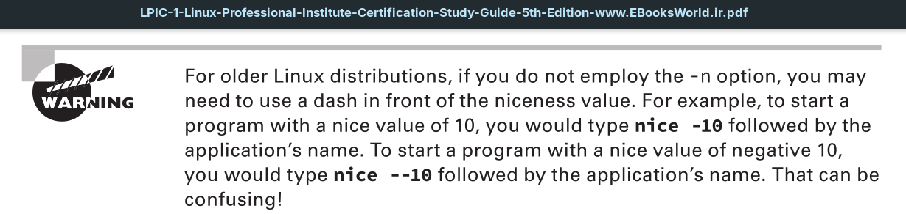

The scheduling priority for a process determines when it obtains CPU time and memory resources in comparison to other processes that operate at a different priority. However, you may run some applications that need either a higher or lower level of priority.

The `nice` and `renice` commands allow you to set and change a program’s niceness level, which in turn modifies the priority level assigned by the system to an application. The `nice` command allows you to start an application with a nondefault niceness level setting. The format looks like this:
```
nice -n VALUE COMMAND
```
The **VALUE** parameter is a numeric value from –20 to 19. The lower the number, the higher priority the process receives. The default niceness level is zero.
The **COMMAND** argument indicates the program must start at the specified niceness level.



When the program is running, you can open another terminal and view the application process via the `ps` command. An example is shown in Listing 2.54. Notice the value in the **NI** (*nice*) column is 10.



To change the priority of a process that’s already running, use the `renice` command:
```
renice PRIORITY [-p PIDS] [-u USERS] [-g GROUPS]
```
The `renice` command allows you to change the priority of multiple processes based on a list of **PID** values, all of the processes started by one or more users, or all of the processes started by one or more groups.



Only if you have super user privileges can you set a nice value less than 0 (increase the priority) of a running process


Notice that you can either employ the -n option or just leave it off. This works for both the `nice` and `renice` commands.



