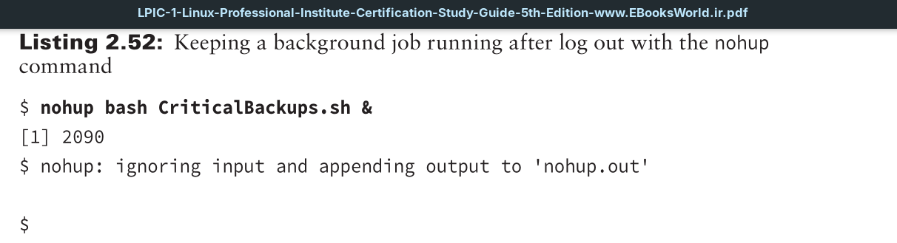

Each background process is tied to your session’s terminal. If the terminal session exits (for example, you log out of the system), the background process also exits. Some terminal emulators warn you if you have any running background processes associated with the terminal, but others don’t.

If you want your script to continue running in background mode after you’ve logged off the terminal, you’ll need to employ the `nohup` utility. This command will make your background jobs immune to hang-up signals, which are sent to the job when a terminal session exits.

Notice that the `nohup` command will force the application to ignore any input from `STDIN` (covered in Chapter 1). By default `STDOUT` and `STDERR` are redirected to the `$HOME/nohup.out` file. If you want to change the output filename for the command to use, you’ll need to employ the appropriate redirection operators on the `nohup` command string.
