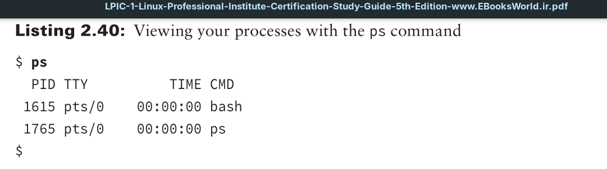
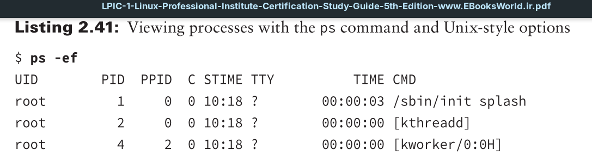
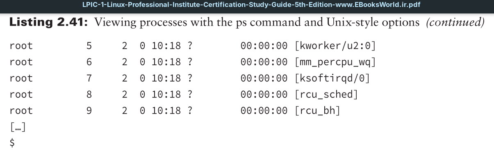

You can look at processes that are currently running on the Linux system by using the `ps` command.

By default, the `ps` program shows only the processes that are running in the current user shell. In this example, we only had the command prompt shell running (Bash) and, of course, the `ps` command.

The basic output of the `ps` command shows the `PID` assigned to each process, the terminal (TTY) that they were started from, and the CPU time that the process has used.

The tricky feature of the `ps` command (and the reason that makes it so complicated) is that at one time there were two versions of it in Linux. Each version had its own set of command-line options controlling the information it displayed. That made switching between systems somewhat complicated.

The GNU developers decided to merge the two versions into a single `ps` program, and of course, they added some additional switches of their own. Thus, the current `ps` program used in Linux supports three different styles of command-line options:
- Unix-style options, which are preceded by a dash
- Berkley Software Distribution (BSD)–style options, which are not preceded by a dash
- GNU long options, which are preceded by a double dash

This makes for lots of possible switches to use with the `ps` command. You can consult the `ps` manual page to see all possible options that are available. Most Linux administrators have their own set of commonly used switches that they remember for extracting pertinent information. For example, if you need to see every process running on the system, use the Unix-style `-ef` option combination.

This format provides some useful information about the processes running:
- **UID:** The user responsible for running the process
- **PID:** The process ID of the process
- **PPID:** The process ID of the parent process (if the process was started by another process)
- **C:** The processor utilization over the lifetime of the process
- **STIME:** The system time when the process was started
- **TTY:** The terminal device from which the process was started
- **TIME:** The cumulative CPU time required to run the process
- **CMD:** The name of the program that was started in the process

Also notice in the `-ef` output that some process command names are shown in brackets. That indicates processes that are currently swapped out from physical memory into virtual memory on the hard drive.
