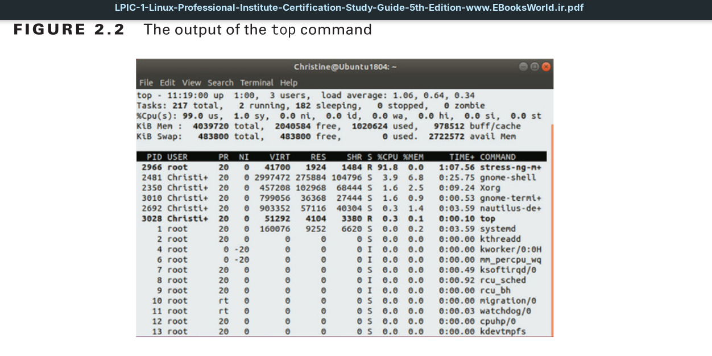
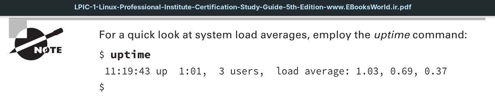
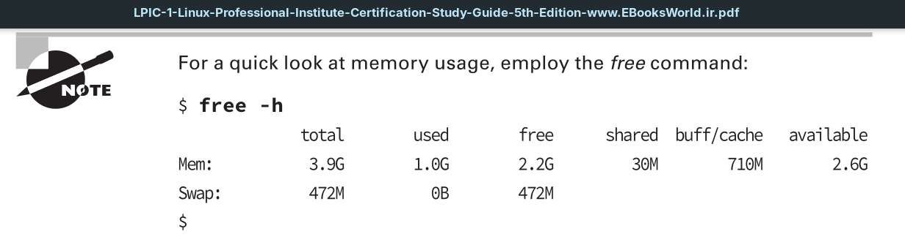
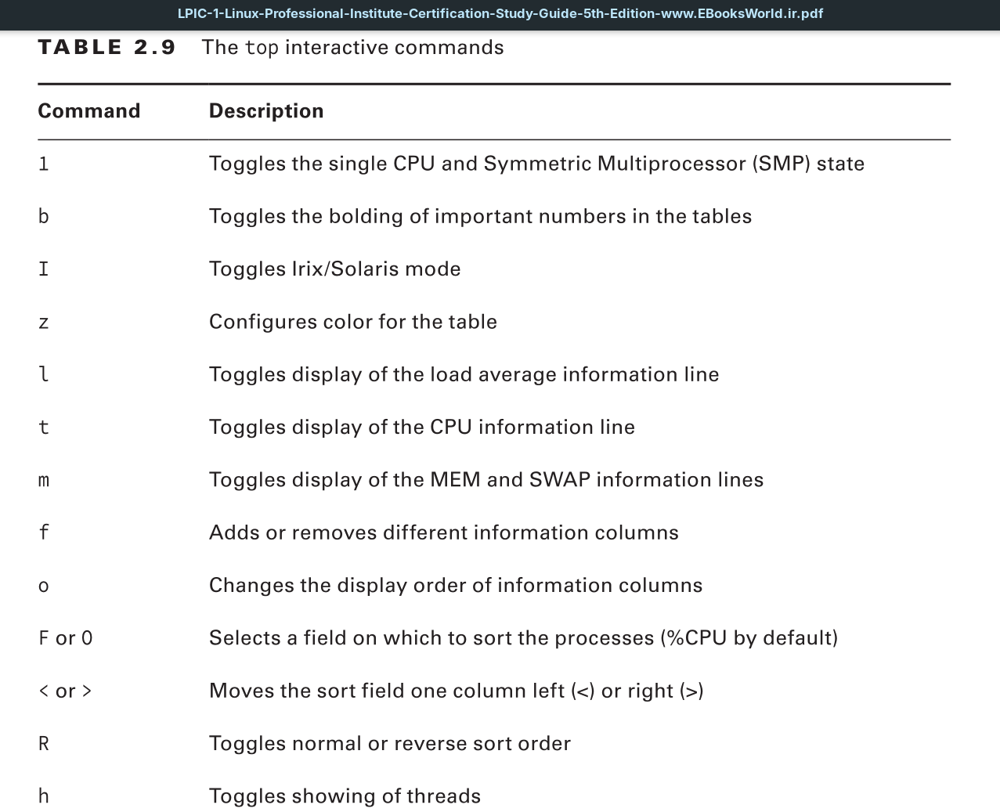
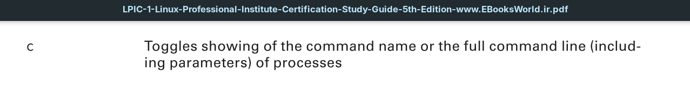
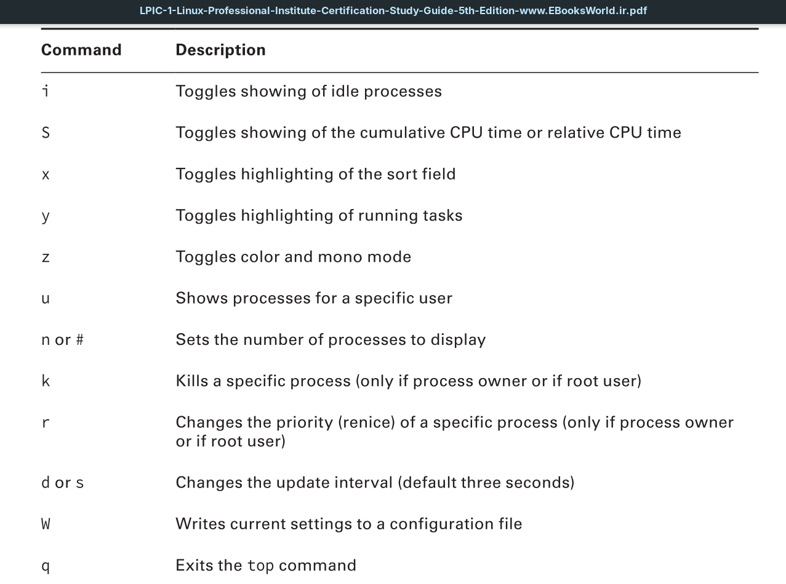
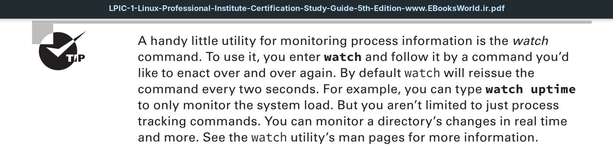

The `ps` command is a great way to get a snapshot of the processes running on the system, but sometimes you need to see more information. For example, if you’re trying to find trends about processes that are frequently swapped in and out of memory, it’s hard to do that with the `ps` command.

The **top** command can solve this problem. It displays process information similar to the `ps` command, but it does it in real-time mode.

The first section of the top output shows general system information. The first line shows the current time, how long the system has been up, the number of users logged in, and the load average on the system.

The load average appears as three numbers: the 1-minute, 5-minute, and 15-minute load averages. The higher the values, the more load the system is experiencing. It’s not uncommon for the 1-minute load value to be high for short bursts of activity. If the 15-minute load value is high, your system may be in trouble.

It provides the exact same system load average information as does the
top utility as well as data on how long the Linux system has been running.

The top utility’s second line shows general process information (called tasks in top):
how many processes are running, sleeping, stopped, or in a zombie state.

The next line shows general CPU information. The top display breaks down the CPU utilization into several categories depending on the owner of the process (user versus system processes) and the state of the processes (running, idle, or waiting).

Following that, in the top utility’s output there are two lines that detail the status of the system memory. The first line shows the status of the physical memory in the system, how much total memory there is, how much is currently being used, and how much is free. The second memory line shows the status of the swap memory area in the system (if any is installed), with the same information.

It provides similar memory information as does the top utility, but you have a wider choice of options. For example, the -h switch (human read- able), as shown in the proceeding example, adds unit labels for easier reading.

Finally, the next top utility section shows a detailed list of the currently running processes, with some information columns that should look familiar from the `ps` command output:
- **PID:** The process ID of the process
- **USER:** The username of the owner of the process
- **PR:** The priority of the process
- **NI:** The nice value of the process
- **VIRT:** The total amount of virtual memory used by the process
- **RES:** The amount of physical memory the process is using
- **SHR:** The amount of memory the process is sharing with other processes
- **S:** The process status (D = interruptible sleep, I = idle, R = running, S = sleeping, T = traced or stopped, and Z = zombie)
- **%CPU:** The share of CPU time that the process is using
- **%MEM:** The share of available physical memory the process is using
- **TIME+:** The total CPU time the process has used since starting
- **COMMAND:** The command-line name of the process (program started)

By default, when you start top, it sorts the processes based on the %CPU value. You can change the sort order by using one of several interactive commands. Each interactive command is a single character you can press while top is running and changes the behavior of the program.

You have lots of control over the output of the top command. Use the F or O command to toggle which field the sort order is based on. You can also use the r interactive command to reverse the current sorting. Using this tool, you can often find offending processes that have taken over your system.

