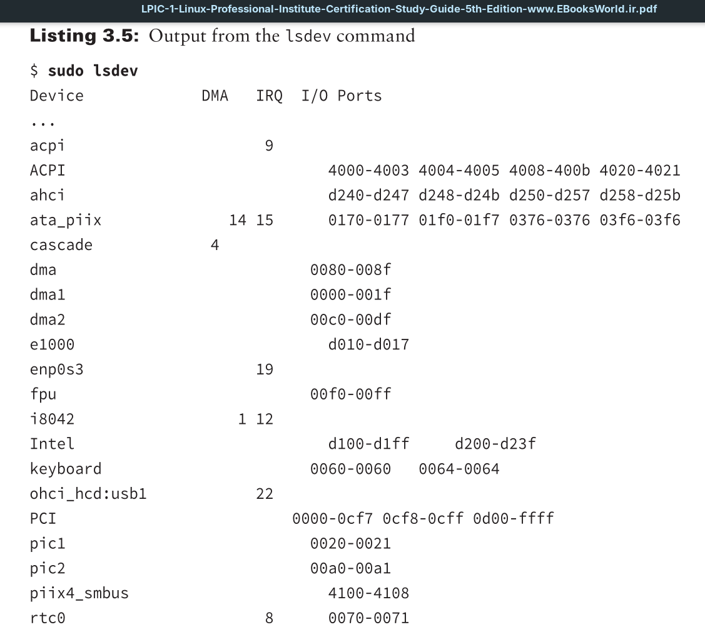
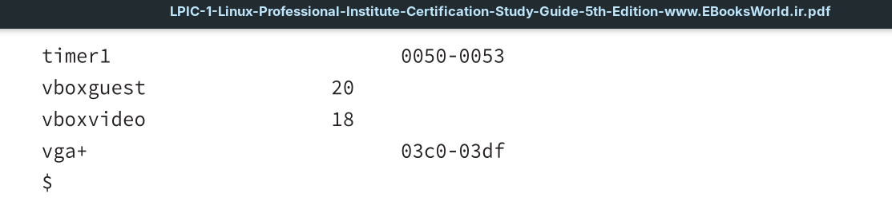
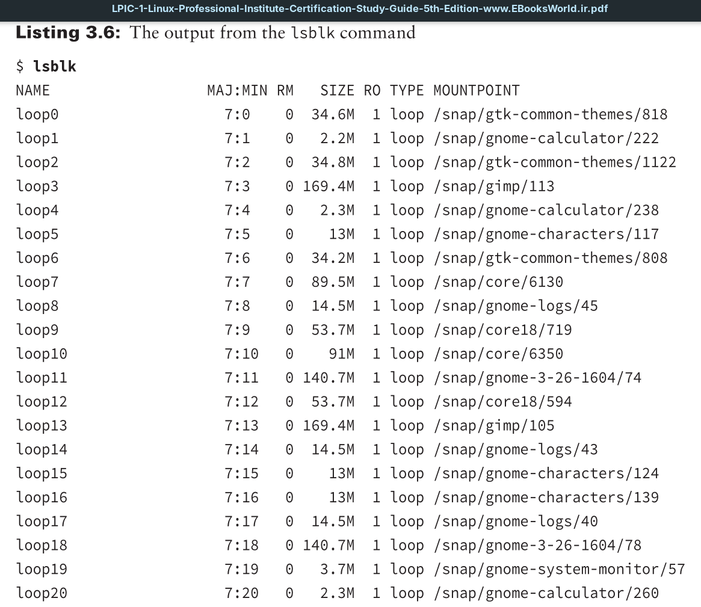
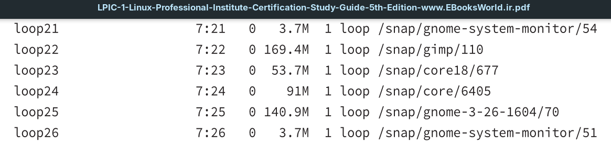
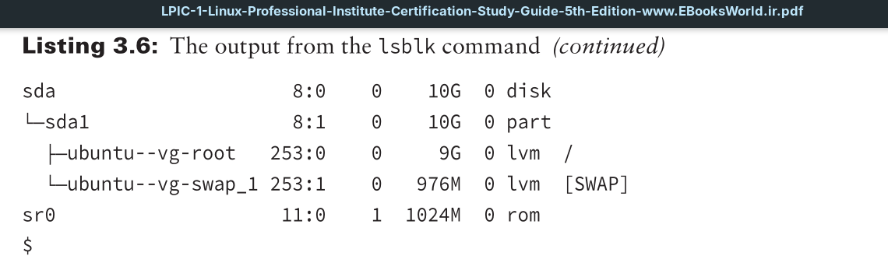
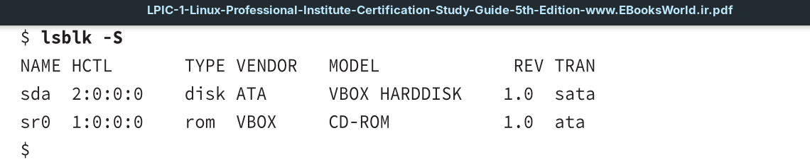

One of the first tasks for a new Linux administrator is to find the different devices installed on the Linux system. Fortunately, there are a few command-line tools to help out with that.

The `lsdev` command-line command displays information about the hardware devices installed on the Linux system. It retrieves information from the `/proc/interrupts`, `/proc/ ioports`, and `/proc/dma` virtual files and combines them together in one output.

This gives you one place to view all the important information about the devices running on the system, making it easy to pick out any conflicts that can be causing problems.

The `lsblk` command displays information about the block devices installed on the Linux system. By default, the `lsblk` command displays all block devices.

Notice that at the end of Listing 3.6, the `lsblk` command also indicates blocks that are related, as with the device-mapped **LVM** volumes and the associated physical hard drive. You can modify the `lsblk` output to see additional information or just display a subset of the information by adding command-line options. The `-S` option displays information only about *SCSI* block devices on the system.

This is a quick way to view the different *SCSI* drives installed on the system.

