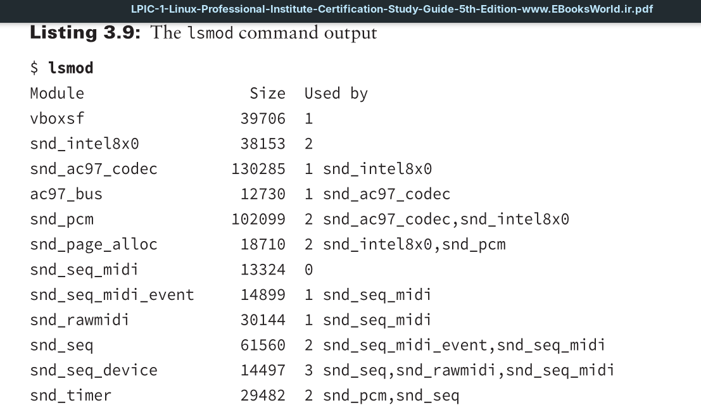
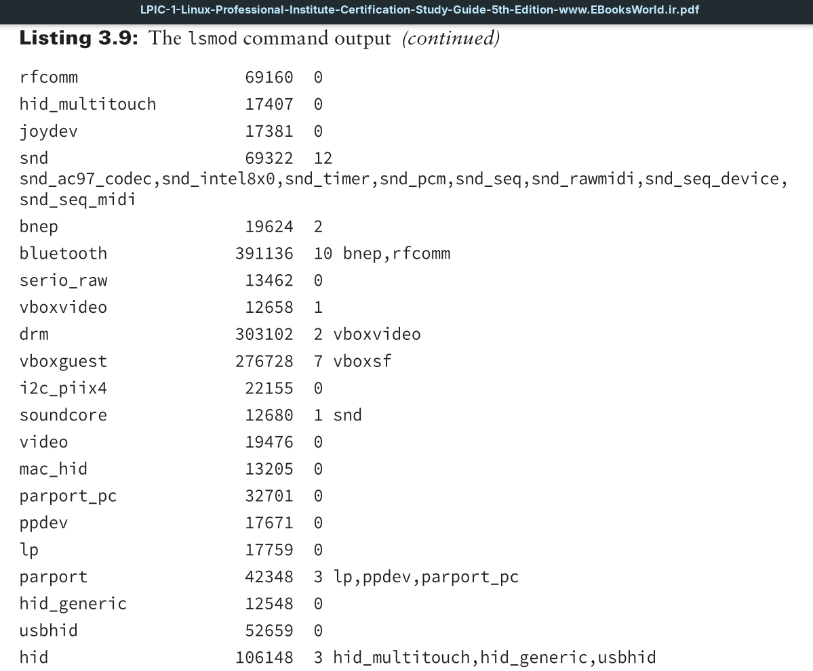
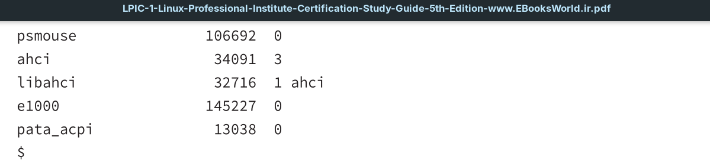

The first command is `lsmod`, which lists all modules installed on your system.

Notice that the `lsmod` command also shows which modules are used by other modules. This can be crucial information when you’re trying to troubleshoot hardware issues.