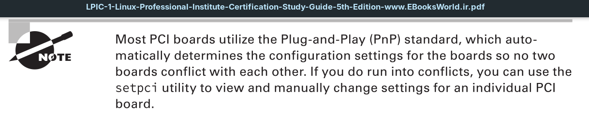

The *Peripheral Component Interconnect* (**PCI**) standard was developed in 1993 as a method for connecting hardware boards to PC motherboards. The standard has been updated a few times to accommodate faster interface speeds, as well as increasing data bus sizes on motherboards. The **PCI** Express (**PCIe**) standard is currently used on most server and desktop workstations to provide a common interface for external hardware devices.

Lots of different client devices use **PCI** boards to connect to a server or desktop workstation:
- **Internal hard drives:** Hard drives using the *Serial Advanced Technology Attachment* (**SATA**) and the *Small Computer System Interface* (**SCSI**) interface often use **PCI** boards to connect with workstations or servers. The Linux kernel automatically recognizes both **SATA** and **SCSI** hard drives connected to **PCI** boards.
- **External hard drives:** Network hard drives using the Fibre Channel standard provide a high-speed shared drive environment for server environments. To communicate on a fiber channel network, the server usually uses **PCI** boards that support the *host bus adapter* (**HBA**) standard.
- **Network interface cards:** Hard-wired network cards allow you to connect the workstation or server to a local area network (LAN) using the common RJ-45 cable standard. These types of connections are mostly found in high-speed network environments that require high throughput to the network.
- **Wireless cards:** *PCI* boards are available that support the IEEE 802.11 standard for wireless connections to *LANs*. Although they are not commonly used in server environments, they are very popular in workstation environments.
- **Bluetooth devices:** The Bluetooth technology allows for short distance wireless communication with other Bluetooth devices in a peer-to-peer network setup. They are most commonly found in workstation environments.
- **Video accelerators:** Applications that require advanced graphics often use video accelerator cards, which offload the video processing requirements from the CPU to provide faster graphics. While these are popular in gaming environments, you’ll also find video accelerator cards used in video processing applications for editing and processing movies.
- **Audio cards:** Similarly, applications that require high-quality sound often use specialty audio cards to provide advanced audio processing and play, such as handling Dolby surround sound to enhance the audio quality of movies.

