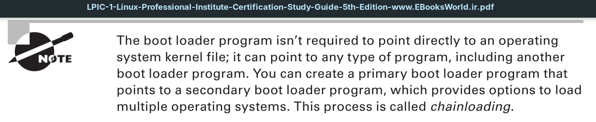

The **BIOS** firmware found in older workstations and servers was somewhat limited. It had a simple menu interface that allowed you to change some settings to control how the system found hardware and define what device the **BIOS** should use to start the operating system.

One limitation of the original **BIOS** firmware was that it could read only one sector’s worth of data from a hard drive into memory to run. As you can probably guess, that’s not enough space to load an entire operating system. To get around that limitation, most operating systems (including Linux and Microsoft Windows) split the boot process into two parts.

First, the **BIOS** runs a *boot loader* program, a small program that initializes the necessary hardware to find and run the full operating system program. It is usually located at another place on the same hard drive but sometimes on a separate internal or external storage device.

The *boot loader* program usually has a configuration file so that you can tell it where to look to find the actual operating system file to run or even to produce a small menu allowing the user to boot between multiple operating systems.

To get things started, the **BIOS** must know where to find the *boot loader* program on an installed storage device. Most BIOS setups allow you to load the boot loader program from several locations:
- An internal hard drive
- An external hard drive
- A CD or DVD drive
- A USB memory stick
- An ISO file
- A network server using either NFS, HTTP, or FTP

When booting from a hard drive, you must designate which hard drive, and partition on the hard drive, the **BIOS** should load the *boot loader* program from. This is done by defining a **master boot record** (*MBR*).

The **MBR** is the first sector on the first hard drive partition on the system. There is only one **MBR** for the computer system. The *BIOS* looks for the **MBR** and reads the program stored there into memory. Since the *boot loader* program must fit in one sector, it must be very small, so it can’t do too much. The *boot loader* program mainly points to the location of the actual **operating system kernel file**, stored in a boot sector of a separate partition installed on the system. There are no size limitations on the **kernel boot file**.

