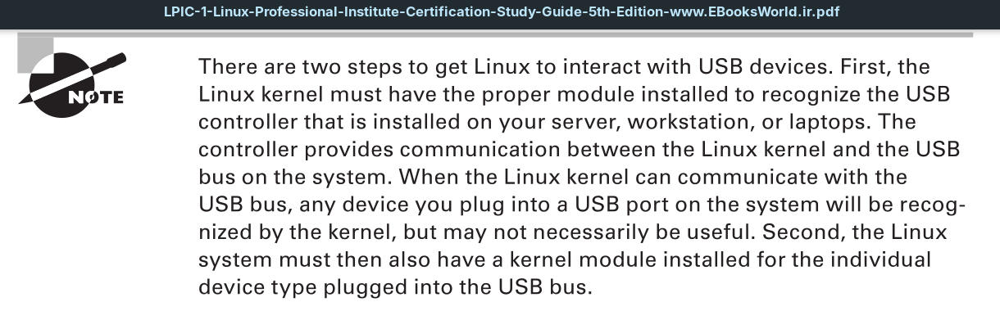

The *Universal Serial Bus* (**USB**) interface has become increasingly popular due to its ease of use and its increasing support for high-speed data communication. Since the USB interface uses serial communications, it requires fewer connectors with the motherboard, allowing for smaller interface plugs.

The USB standard has evolved over the years. The original version, 1.0, supported data transfer speeds only up to 12 Mbps. The 2.0 standard increased the data transfer speed to 480 Mbps. The current USB standard, 3.2, allows for data transfer speeds up to 20 Gbps, making it useful for high-speed connections to external storage devices.

There are many different devices that can connect to systems using the USB interface. You can find hard drives, printers, digital cameras and camcorders, keyboards, mice, and network cards that have versions that connect using the USB interface.

