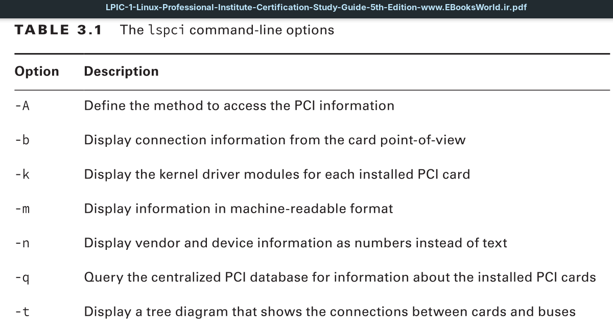
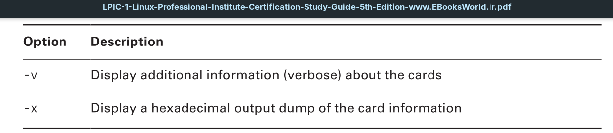
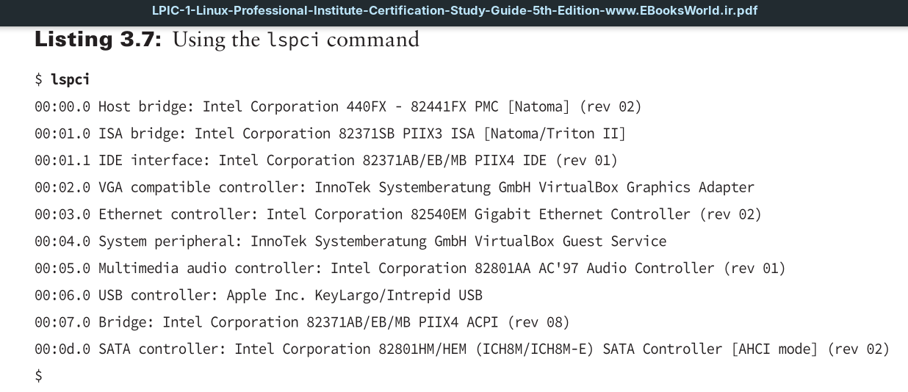

The `lspci` command allows you to view the currently installed and recognized **PCI** and **PCIe** cards on the Linux system. There are lots of command-line options you can include with the `lspci` command to display information about the **PCI** and **PCIe** cards installed on the system.

The output from the `lspci` command without any options shows all the devices connected to the system.

You can use the output from the `lspci` command to troubleshoot **PCI** card issues, such as when a card isn’t recognized by the Linux system.
